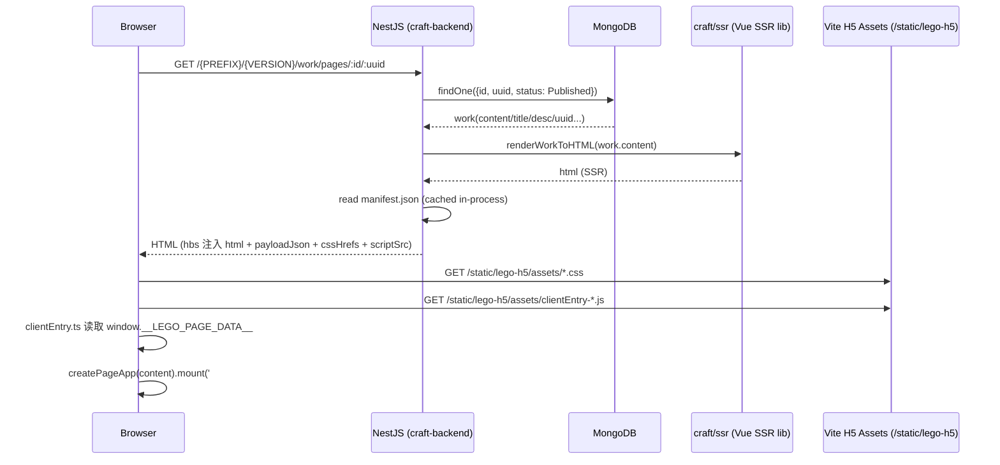

## 作品发布页 SSR 与 Hydration 流程（手把手复现/联调）（2026-01）

> 目标读者：第一次接触本项目 SSR 的同学（可按本文一步步复现）。  
> 本文目标：你能从“构建产物 → 请求链路 → 模板注入 → 浏览器 hydration”完整跑通，并能快速定位高频问题（manifest 缺失、静态资源 403/404、水合不触发等）。

---

### 1) 背景：本项目的 SSR 是怎么一回事？

这里的 SSR 指的是：

- **后端（NestJS）拿到 work.content 后**，调用 `@my-lego/craft/ssr`（Vue SSR）把组件树渲染成 HTML 字符串；
- 然后通过 `hbs` 模板输出整页 HTML，并注入：
  - SSR HTML（首屏可见）
  - `window.__LEGO_PAGE_DATA__`（给客户端 hydration 用的数据）
  - 由 Vite 产出的、带 hash 的 JS/CSS（从 manifest 解析得到）
- 浏览器加载后执行 `clientEntry-*.js`，读取 `window.__LEGO_PAGE_DATA__`，在 `#app` 上执行 `app.mount('#app')` 完成 hydration。

> 注意：这套链路不是 Next.js/Nuxt，而是“后端模板 + Vue SSR library + Vite client build”的组合。

---

### 2) 你要知道的关键路径（先记住，后面排障就靠它）

#### 2.1 服务端入口（请求链路）

- `GET /{PREFIX}/{VERSION}/work/pages/:id/:uuid`
  - Controller：`packages/craft-backend/src/module/work/work.controller.ts`
  - Service：`packages/craft-backend/src/module/work/workToH5.service.ts`
  - 模板：`packages/craft-backend/views/h5page.hbs`

> 说明：`PREFIX` 默认 `/api`；`VERSION` 来自 env（例如 `v1`）。这是 Nest 全局配置，不是写死的。

#### 2.2 前端 SSR 子模块（被后端复用）

目录：`packages/craft/src/ssr/`

- `createPageApp.tsx`：创建 SSR/CSR 共用的 Vue app（`createSSRApp`）
- `renderWorkToHTML.ts`：Node 侧 `renderToString` 输出 HTML
- `clientEntry.ts`：浏览器侧 hydration 入口（读取 `window.__LEGO_PAGE_DATA__`）
- `types.ts`：SSR 所需最小数据结构（`WorkContent`/`ComponentData`）

#### 2.3 构建配置（产物在哪儿、manifest 为什么必须）

- `packages/craft/vite.ssr.config.ts`：构建 `dist-ssr/index.cjs`（给后端 require）
- `packages/craft/vite.h5.config.ts`：构建 `static/lego-h5/`（给浏览器加载）

---

### 3) 时序图（从请求到水合）



---

### 4) 手把手复现（开发/联调）

#### 4.1 前置条件

- 已安装 `pnpm`
- Node 版本满足 `@my-lego/craft` 的 `engines.node`（见 `packages/craft/package.json`）
- 本地已能启动 `craft-backend`（Mongo/Redis 等依赖你现有环境配置）

#### 4.2 一条命令构建所有 SSR 所需产物（推荐）

在 `packages/craft-backend` 下执行 build（它会先构建前端产物再 nest build）：

```bash
pnpm -C packages/craft-backend build
```

该命令会做三件事（脚本事实）：

- `pnpm -F @my-lego/craft run build:h5` → 生成 `packages/craft-backend/static/lego-h5/`（含 `.vite/manifest.json`）
- `pnpm -F @my-lego/craft run build:ssr` → 生成 `packages/craft/dist-ssr/index.cjs`（后端通过 `@my-lego/craft/ssr` 使用）
- `nest build` → 生成 `packages/craft-backend/dist/`（含 views/static 资源拷贝）

#### 4.3 启动后端

开发模式：

```bash
pnpm -C packages/craft-backend dev
```

生产模式（先 build 再 start:prod）：

```bash
pnpm -C packages/craft-backend build
pnpm -C packages/craft-backend start:prod
```

> 说明：后端在 `main.ts` 里启用了模板引擎 `hbs`，并通过 `@nestjs/serve-static` + `/static` 路径发布静态资源。

#### 4.4 准备一个“已发布（Published）”的作品

SSR 成品页只渲染 `status=Published` 的作品（代码事实），因此你必须先拿到：

- `id`（数字）
- `uuid`（短 uuid，8 位，创建时生成）

推荐两种方式：

- **方式 A（推荐）**：走你已有的“前端编辑器 → 发布作品”流程（拿到作品 id/uuid）
- **方式 B（接口联调）**：用 API 创建并发布（需要 JWT）
  - 创建：`POST /{PREFIX}/{VERSION}/work/create`（需要登录）
  - 发布：`POST /{PREFIX}/{VERSION}/work/publish`（需要登录）
  - 说明：上述接口在 `WorkController` 中均受 `JwtAuthGuard` 保护，通常使用 `Authorization: Bearer <accessToken>` 传递 token（以你项目 auth 约定为准）。

#### 4.5 打开 SSR 成品页

拼出最终 URL：

- `/{PREFIX}/{VERSION}/work/pages/{id}/{uuid}`

例（仅示意）：当 `PREFIX=/api`、`VERSION=v1` 时：

- `http://localhost:{PORT}/api/v1/work/pages/1/AbcDeF12`

你应该能看到：

- 首屏已有 SSR 渲染出来的内容（即使 JS 禁用也能看到基础结构）
- Network 里会加载：
  - `/static/lego-h5/assets/*.css`（如果有）
  - `/static/lego-h5/assets/clientEntry-*.js`
- Console 会出现 `"[lego-h5] client entry loaded"`（来自 `clientEntry.ts`）

---

### 5) 打包发布路径说明（为什么后端能在 dist 里找到 manifest）

后端读取 manifest 的路径不是“源码目录”，而是“构建产物目录”：

- `resolvePackagedStaticRootPath()` 返回的是基于 `__dirname` 的 `dist/.../static`
- 这要求：
  - `packages/craft-backend/static/**` 在构建时会被拷贝进 `dist/**/static/**`
  - 所以你必须在 build 阶段先产出 `static/lego-h5/.vite/manifest.json`

如果你发现：

- 开发时 OK，但 `start:prod` 报 manifest 不存在  
通常是“打包产物缺少 static 资源拷贝”或“build 顺序不正确”。

---

### 6) 高频问题（按现象快速定位）

#### 6.1 现象：SSR 页面能打开，但没样式/没水合（Console 没日志或只有 SSR）

优先看 Network：

- **如果 `/static/lego-h5/*` 是 403**：
  - 检查 env：`STATIC_ALLOWED_ORIGINS`
  - 该变量一旦配置（非空），后端会限制 `/static/*` 资源来源
  - 你需要把“打开页面的来源 origin”加入 allowlist（例如 `http://localhost:3000`）

#### 6.2 现象：后端报错 `manifest.json: 的资源不存在`

排查顺序：

- 是否执行过 `pnpm -F @my-lego/craft run build:h5`
- 是否在 `packages/craft-backend/static/lego-h5/.vite/manifest.json` 能找到
- manifest 里是否存在 key：`"src/ssr/clientEntry.ts"`
  - 如果你改过入口文件路径，必须同步更新后端 `H5_MANIFEST_ENTRY_KEY`

#### 6.3 现象：更新了 H5 client build，但页面仍引用旧 hash

原因（代码事实）：

- 后端 `WorkToH5Service` 会把 `scriptSrc/cssHrefs` **进程内缓存**（只读一次 manifest）

解决：

- **重启后端进程**（当前实现最直接）

#### 6.4 现象：SSR 渲染缺组件（页面某块空了，但不一定报错）

原因（代码事实）：

- `createPageApp.tsx` 会用 `componentMap[comp.name]` 找组件
- 找不到组件会 `return null`

排查：

- 检查 `work.content.components[].name` 是否为已注册组件名
- 检查 `componentMap` 是否包含对应 key（大小写是否一致）

#### 6.5 现象：水合报 mismatch / 控制台出现 Vue hydration 警告

常见原因：

- SSR 与 CSR 使用的组件实现不一致（版本/分支差异）
- `work.content` 在服务端渲染后，客户端拿到的数据与服务端不一致（注入/序列化问题）

排查建议：

- 打开页面源代码（View Source）确认 `window.__LEGO_PAGE_DATA__` 是否完整且未被转义
- 确认 `payloadJson` 来自 `createSafeJson`，不要自行拼接字符串

---

### 7) 关键文件索引（需要改东西从这里开始）

- 后端渲染：
  - `packages/craft-backend/src/module/work/work.controller.ts`
  - `packages/craft-backend/src/module/work/workToH5.service.ts`
  - `packages/craft-backend/views/h5page.hbs`
- 静态资源与发布策略：
  - `packages/craft-backend/src/main.ts`
  - `packages/craft-backend/src/common/static/static-origin-allow.middleware.ts`
  - `packages/craft-backend/src/common/static/static-assets.utils.ts`
- 前端 SSR 子模块：
  - `packages/craft/src/ssr/createPageApp.tsx`
  - `packages/craft/src/ssr/renderWorkToHTML.ts`
  - `packages/craft/src/ssr/clientEntry.ts`
  - `packages/craft/src/ssr/types.ts`
- Vite 配置：
  - `packages/craft/vite.h5.config.ts`
  - `packages/craft/vite.ssr.config.ts`


