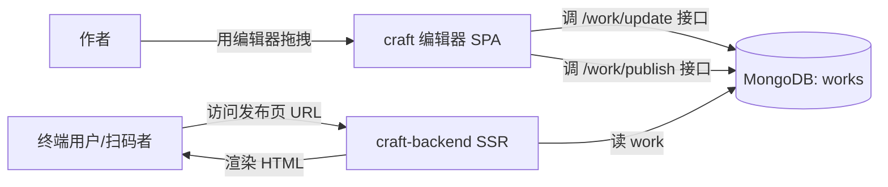
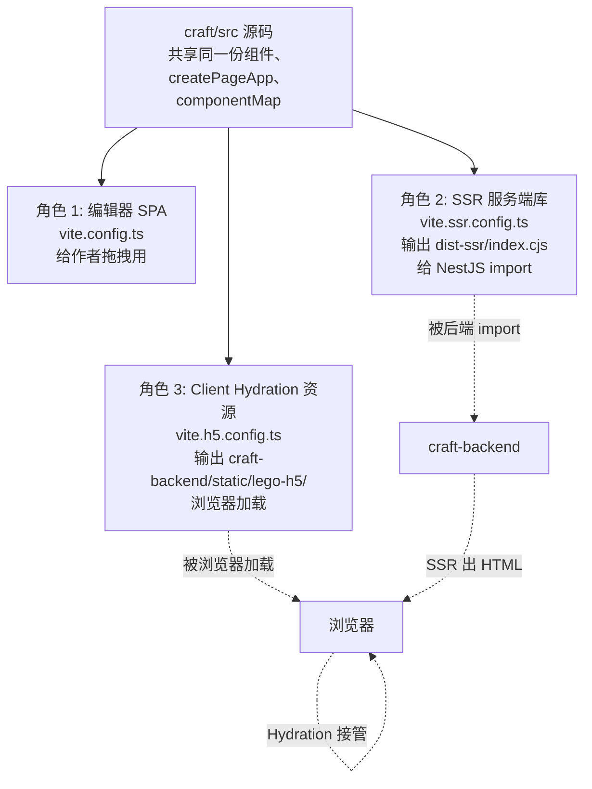
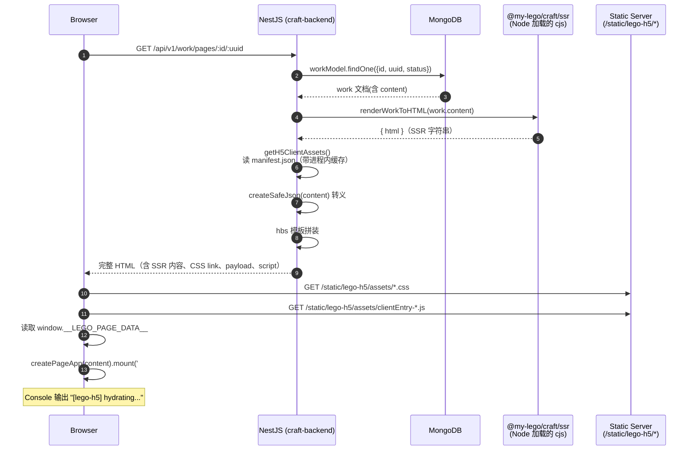
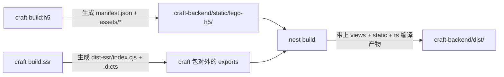

## 作品发布页 SSR 与 Hydration 流程（完全指南）

> 目标读者：完全没接触过 SSR 的同学，也能从 0 跑通本项目的发布页链路、看懂打包配置、独立排障。
>
> 阅读本文之前你只需要知道：本项目是一个"用编辑器拖拽组件 → 发布成 H5 页面"的低代码平台。

---

### 0. 阅读指南（按身份选路径）

| 你的身份 | 推荐路径 |
| --- | --- |
| 第一次接触本项目 SSR 的新人 | 全文按顺序读：§1 → §2 → §3 → §4 → §5 → §7 |
| 只想跑起来联调 | §3.1 总览图 + §7 手把手复现 |
| 线上/本地出问题排障 | §8 高频问题清单 → 按现象反查 §4 / §5 / §6 |
| 想动 SSR 架构（升级 Vite/拆包/换模板引擎） | §3 + §5 + §6 + 附录 B |

---

### 1. 业务背景：作品发布页是什么

#### 1.1 三个角色，一句话讲清


```mermaid
flowchart LR
  A[作者] -- 用编辑器拖拽 --> B[craft 编辑器 SPA]
  B -- 调 /work/update 接口 --> C[(MongoDB: works)]
  B -- 调 /work/publish 接口 --> C
  D[终端用户/扫码者] -- 访问发布页 URL --> E[craft-backend SSR]
  E -- 读 work --> C
  E -- 渲染 HTML --> D
```

- **作者（Author）**：在 `@my-lego/craft` 编辑器里拖拽组件、设置样式、点"发布"。
- **终端用户（Visitor）**：拿到分享链接 / 扫码 → 打开 `https://xxx/api/v1/work/pages/:id/:uuid` → 看到一个 H5 落地页。
- **craft-backend**：负责"把 DB 里的 `work.content` 变成 HTML 吐给浏览器"——这就是本文要讲的 SSR 链路。

#### 1.2 数据形态：`work.content` 长什么样

数据库字段在 `47:101:packages/craft-backend/src/database/mongo/schema/work.schema.ts`，其中关键的 `content` 字段是 `Mixed` 类型，运行时形如：

```json
{
  "components": [
    {
      "id": "uuid-v4-xxx",
      "name": "LText",
      "props": { "text": "标题", "fontSize": "20px", "color": "#000" }
    },
    {
      "id": "uuid-v4-yyy",
      "name": "LImage",
      "props": { "src": "https://...", "width": "318px" }
    }
  ],
  "props": { "backgroundColor": "#fff", "height": "667px" }
}
```

类型定义见 `1:33:packages/craft/src/ssr/types.ts`。**SSR 渲染需要的全部输入就是这个对象**。

#### 1.3 发布页 ≠ 编辑器

| | 编辑器 SPA | 作品发布页 |
| --- | --- | --- |
| URL | `/editor/:id` | `/api/v1/work/pages/:id/:uuid` |
| 谁来提供 HTML | Vite dev / 静态 SPA 构建 | NestJS 后端动态渲染 |
| 谁是消费者 | 作者本人 | 终端用户（任何人） |
| 是否 SSR | 否（纯 CSR） | 是（SSR + Hydration） |
| 构建产物 | `vite.config.ts` 输出的 SPA | `vite.h5.config.ts` + `vite.ssr.config.ts` 双产物 |

> 一个常见误解："craft 是前端，所以发布页应该也是 craft 提供的"。**不对**：发布页的 HTML 由 craft-backend 拼装吐出，craft 只是为后端提供"渲染函数"和"水合脚本"两份产物。

---

### 2. 为什么需要 SSR（零基础也能看）

#### 2.1 名词扫盲

- **CSR（Client-Side Rendering，客户端渲染）**：服务器只吐一个空壳 HTML，所有内容靠浏览器加载 JS 后再渲染。典型代表：Vue/React 的 SPA。
- **SSR（Server-Side Rendering，服务端渲染）**：服务器直接把组件渲染成完整 HTML 字符串吐给浏览器，首屏不需要等 JS。
- **Hydration（水合）**：浏览器收到 SSR 出的"静态 HTML"之后，再加载一份 JS，把这棵静态 DOM **重新接管成一个活的 Vue 应用**（事件可以响应、数据可以更新）。形象点：SSR 给你一具"标本"，Hydration 给它注入灵魂。
- **Manifest（清单）**：Vite 构建时给每个 JS/CSS 加 hash 文件名（如 `clientEntry-DXsTORWK.js`）做缓存，但服务端模板不可能写死这串 hash。所以 Vite 会同时输出一份 `manifest.json`，告诉服务端"我这次构建的 entry 真实文件名是什么"。
- **Lib mode（库模式）**：Vite 把代码当成"npm 包"打成 `index.js/index.cjs` 而不是带入口 HTML 的应用。这种模式适合"被别人 import 的库"。
- **External（外部依赖）**：构建时不把某个依赖打进产物，运行时再去找。比如 SSR 库 external 了 `vue`，是为了和后端用同一个 vue 副本，避免双实例问题。

#### 2.2 纯 CSR 在本项目的痛点

如果作品发布页用 CSR，会出现：

1. **白屏问题**：用户点开链接到看到内容之间，要经历"下载 HTML → 下载 JS → 执行 JS → 渲染 DOM"。在 4G/3G 弱网或低端 Android 上肉眼可见地慢。本项目主要是分享场景，首屏体验直接决定留存。
2. **分享卡片瞎了**：微信/QQ/微博抓取分享卡片时只读 HTML 的 `<title>` `<meta name=description>` 和首屏内容。CSR 给它的 HTML 是空壳，分享出去的卡片就只有"加载中"。
3. **SEO 差**：搜索引擎大概率不会等你 JS 跑完，CSR 页面在搜索结果里几乎没排名。
4. **"作品消费"本来就是只读为主**：99% 的访问都是读取，没必要让客户端再跑一遍组件树构建。

#### 2.3 为什么是 "SSR + Hydration" 而不是纯静态 SSR

如果只是纯静态 SSR（吐完 HTML 就结束），未来要加交互（按钮点击、跳转、动画、表单）就会卡住——HTML 里没有事件绑定，DOM 是死的。

我们的策略是：**首屏 HTML 由 SSR 吐出（解决白屏/SEO/分享卡），同时附带一份 client entry JS 做 Hydration（解决未来的交互需求）**。

> 当下作品组件还没什么交互，但 `LText` 已经有 `@click="handleClick"`（见 `1:10:packages/craft/src/components/LText.vue`），后续会扩展跳转、自定义动作等，所以 Hydration 不是过度设计。

#### 2.4 为什么不直接用 Next.js / Nuxt

候选方案对比：

| 方案 | 优点 | 缺点（对本项目而言） |
| --- | --- | --- |
| Next.js / Nuxt | 工程化齐全 | 完全替换后端栈；和现有 NestJS 业务（鉴权、CASL、Mongo）双框架割裂 |
| Vite SSR + 自建后端 | 灵活、可与 NestJS 平滑集成 | 需要自己拼装"渲染 + 资源 + 模板"链路 |
| 纯静态生成（SSG） | 简单 | 作品数量动态、内容随时改，无法预生成 |

我们最终选 **Vite SSR + NestJS + hbs**：

- NestJS 已经承担了所有业务（auth/work/upload）。把 SSR 当成"NestJS 的一个普通路由"接入是最自然的。
- hbs 是 Express 生态的轻模板引擎，用来"把 SSR HTML 字符串、payload、CSS link、entry script 拼成完整页面"足够了。
- Vite SSR 库模式天然适合"导出渲染函数给后端调用"。

---

### 3. 架构总览：一份源码三种产物

#### 3.1 craft 同时承担三种角色

这是新人最容易绕晕的点。`@my-lego/craft` 这个包看起来只是个前端项目，但实际上它在不同的构建配置下会输出三种**完全不同形态**的产物：


```mermaid
flowchart TD
  Source[craft/src 源码<br/>共享同一份组件、createPageApp、componentMap]
  Source --> SPA[角色 1: 编辑器 SPA<br/>vite.config.ts<br/>给作者拖拽用]
  Source --> SSRLib[角色 2: SSR 服务端库<br/>vite.ssr.config.ts<br/>输出 dist-ssr/index.cjs<br/>给 NestJS import]
  Source --> ClientH5[角色 3: Client Hydration 资源<br/>vite.h5.config.ts<br/>输出 craft-backend/static/lego-h5/<br/>浏览器加载]

  SSRLib -.被后端 import.-> Backend[craft-backend]
  ClientH5 -.被浏览器加载.-> Browser[浏览器]
  Backend -.SSR 出 HTML.-> Browser
  Browser -.Hydration 接管.-> Browser
```

| 角色 | 产物路径 | 运行环境 | 消费方 |
| --- | --- | --- | --- |
| 编辑器 SPA | `craft/dist/`（暂未单独 build，dev 即用） | 浏览器 | 作者 |
| SSR 服务端库 | `craft/dist-ssr/index.cjs` + `dist-ssr/types/index.d.cts` | Node.js | `craft-backend` |
| Client 资源 | `craft-backend/static/lego-h5/assets/*` + `.vite/manifest.json` | 浏览器 | 终端用户 |

> 关键认知：**SSR 库和 Client 资源虽然源码 99% 重叠，但必须打成两份产物**——它们运行环境不同，打包策略也完全不同（详见 §5.4）。

#### 3.2 共享层：SSR 与 CSR 的"同源根"

为什么 server 和 client 必须共用一套渲染逻辑？因为 Hydration 要求**服务端生成的 DOM 结构和客户端生成的 DOM 结构必须严格一致**，否则 Vue 会抛 hydration mismatch warning，且部分 DOM 会被丢弃重建（性能损失 + 闪烁）。

为此我们把两边的"创建 App"逻辑收敛到同一个文件 `1:30:packages/craft/src/ssr/createPageApp.tsx`：

- Server 侧入口：`1:10:packages/craft/src/ssr/renderWorkToHTML.ts` 调用 `createPageApp(content)` + `renderToString(app)` 出 HTML。
- Client 侧入口：`1:26:packages/craft/src/ssr/clientEntry.ts` 调用 `createPageApp(content)` + `app.mount('#app')` 完成 Hydration。

`componentMap` 也是两边共用的同一个对象（来自 `1:11:packages/craft/src/components/index.ts`），保证"同样的 `comp.name` 在两边解析到同一个组件实现"。

#### 3.3 跨包依赖：后端如何 import craft 的 SSR

后端 `package.json` 里声明了：

```json
"@my-lego/craft": "workspace:^"
```

见 `22:48:packages/craft-backend/package.json`。结合 pnpm workspace（`pnpm-workspace.yaml`），后端 `node_modules/@my-lego/craft` 是 craft 包的软链。

后端这样使用：

```ts
import { renderWorkToHTML, WorkContent } from '@my-lego/craft/ssr'
```

见 `1:11:packages/craft-backend/src/module/work/workToH5.service.ts`。

子路径 `/ssr` 由 craft 的 `package.json exports` 定义（`10:22:packages/craft/package.json`）：

- `require` → `./dist-ssr/index.cjs`（实际加载的 JS）
- `types` → `./dist-ssr/types/index.d.cts`（TS 类型）

> 注意：不是直接 import `craft/src/ssr/*.ts` 源码，而是 import 编译后的 `dist-ssr/index.cjs`。原因是 NestJS（CommonJS + tsc）**不会编译 `.vue` 文件**，必须由 Vite 提前处理掉。


---

### 4. 完整请求链路：一次访问发生了什么

#### 4.1 时序图（含 manifest 与 Hydration）


```mermaid
sequenceDiagram
  autonumber
  participant B as Browser
  participant N as NestJS (craft-backend)
  participant M as MongoDB
  participant SSR as @my-lego/craft/ssr<br/>(Node 加载的 cjs)
  participant FS as Static Server<br/>(/static/lego-h5/*)

  B->>N: GET /api/v1/work/pages/:id/:uuid
  N->>M: workModel.findOne({id, uuid, status})
  M-->>N: work 文档(含 content)
  N->>SSR: renderWorkToHTML(work.content)
  SSR-->>N: { html }（SSR 字符串）
  N->>N: getH5ClientAssets()<br/>读 manifest.json（带进程内缓存）
  N->>N: createSafeJson(content) 转义
  N->>N: hbs 模板拼装
  N-->>B: 完整 HTML（含 SSR 内容、CSS link、payload、script）
  B->>FS: GET /static/lego-h5/assets/*.css
  B->>FS: GET /static/lego-h5/assets/clientEntry-*.js
  B->>B: 读取 window.__LEGO_PAGE_DATA__
  B->>B: createPageApp(content).mount('#app') 完成 Hydration
  Note over B: Console 输出 "[lego-h5] hydrating..."
```

#### 4.2 后端各环节详解

##### 4.2.1 Controller 入口

`243:262:packages/craft-backend/src/module/work/work.controller.ts` 路由 `pages/:id/:uuid`：

- `id`：作品自增 id（`ParseIntPipe` 强校验为数字）。
- `uuid`：8 位 nanoid 短串，避免遍历爆破（见 schema 注释）。
- `?preview=true`：进入预览模式（允许渲染未发布作品，供作者扫码自检）。
- 调用 `workToH5Service.getPageData(...)` 拿到 `pageData`，最后 `res.render('h5page', pageData)` 把数据交给 hbs 模板。

##### 4.2.2 WorkToH5Service.getPageData：核心装配函数

完整实现在 `114:149:packages/craft-backend/src/module/work/workToH5.service.ts`，关键步骤：

1. **鉴权过滤**：正式访问严格 `status=Published`；预览模式允许 `status != Deleted`（即草稿可看）。
2. **取数据**：`workModel.findOne(...).lean()`，注意 `.lean()` 让 mongoose 返回纯对象而不是 Document 实例（SSR 序列化更稳定）。
3. **bodyStyle 计算**：`33:42:packages/craft-backend/src/module/work/workToH5.service.ts` 的 `propsToStyles` 把 `work.content.props` 里的驼峰 key（`fontSize`）转成 css 短横线 key（`font-size`）拼成内联 style。
4. **SSR 出 HTML**：调 `renderWorkToHTML(workContent)`（见 §4.2.3）。
5. **解析 client 资源**：调 `getH5ClientAssets()`（见 §4.2.4）。
6. **payload 安全转义**：调 `createSafeJson(workContent)`（见 §4.2.5）。
7. **返回 pageData**：包含 `html / bodyStyle / title / desc / payloadJson / scriptSrc / cssHrefs`。

##### 4.2.3 renderWorkToHTML：Node 侧 Vue SSR

`1:10:packages/craft/src/ssr/renderWorkToHTML.ts`：

```ts
const app = createPageApp(content)
const html = await renderToString(app)
```

- `createPageApp` 在 `1:30:packages/craft/src/ssr/createPageApp.tsx` 用 `createSSRApp` 创建 App，遍历 `content.components` → 在 `componentMap` 里查到对应组件 → 通过 JSX `<Comp v-bind={comp.props} />` 渲染。
- `renderToString` 来自 `vue/server-renderer`，纯 Node 实现（无 DOM 依赖）。
- 找不到的组件直接 `return null`，保证 SSR 不会因为脏数据崩掉。

> 这部分代码经过 `vite.ssr.config.ts` 编译后的产物是 `craft/dist-ssr/index.cjs`，后端实际加载的是 `.cjs` 文件不是 `.tsx` 源码。

##### 4.2.4 getH5ClientAssets：manifest 解析与缓存

为什么需要 manifest？因为 Vite 给 client 资源的文件名带 hash（如 `clientEntry-DXsTORWK.js`），后端模板里不可能写死。Vite 在 `manifest: true` 配置下会输出一份 `manifest.json`，帮我们做"逻辑名 → 物理 hash 文件名"映射。

实现见 `48:91:packages/craft-backend/src/module/work/workToH5.service.ts`：

- 定位 manifest：`resolvePackagedStaticRootPath() + '/lego-h5/.vite/manifest.json'`
- entry key：`'src/ssr/clientEntry.ts'`（与 `vite.h5.config.ts` 的 `rollupOptions.input` 一致）
- 解析后得到形如：
  - `scriptSrc = '/static/lego-h5/assets/clientEntry-DXsTORWK.js'`
  - `cssHrefs = ['/static/lego-h5/assets/clientEntry-BALUfUHg.css']`
- **进程内缓存**（`cachedH5ClientAssets`）：只读一次文件，之后所有请求都用缓存。生产环境性能友好，但带来"改 client 必须重启后端"的限制（见 §6.2）。

##### 4.2.5 createSafeJson：注入 payload 的安全转义

普通的 `JSON.stringify(workContent)` 不能直接塞进 `<script>...</script>` 里。如果数据中包含 `</script>` 字符串（用户输入的 LText 文案完全可能），HTML 解析器会提前终止 script 标签，导致页面崩坏甚至 XSS。

`2:7:packages/shared/src/inputStr.ts` 的 `createSafeJson` 干了三件事：

```ts
JSON.stringify(data)
  .replace(/</g, '\u003c')    // < 转义，防止 </script> 提前结束
  .replace(/\u2028/g, '\u2028') // 行分隔符
  .replace(/\u2029/g, '\u2029') // 段分隔符（JS 里这俩是非法的字面量换行）
```

##### 4.2.6 hbs 模板拼装

`1:29:packages/craft-backend/views/h5page.hbs` 把 `getPageData` 的返回值拼成完整 HTML。关键点：

- `{{title}} / {{desc}}`：单花括号，会做 HTML 转义，防 XSS。
- `{{{html}}}`：**三花括号**，原样输出 SSR 出的 HTML 字符串（SSR 的 HTML 已经是安全的，再转义就坏了）。
- `{{#each cssHrefs}} <link rel=stylesheet href={{this}}> {{/each}}`：循环注入 CSS 文件。
- `<script>window.__LEGO_PAGE_DATA__ = {{{payloadJson}}};</script>`：把 work.content 注入全局变量，供 client entry 读取。
- `<script type=module src={{scriptSrc}}></script>`：加载客户端 hydration 脚本。

#### 4.3 浏览器各环节详解

##### 4.3.1 加载顺序

浏览器拿到 HTML 后的执行顺序：

1. 解析 `<head>` 中的 `<link rel="stylesheet">`，**并行下载** CSS（不阻塞 HTML 继续解析）。
2. 解析 `<body>` 中的 `<div id="app">{{{html}}}</div>` —— 此时 SSR 出的 DOM 已经在屏幕上可见（**首屏完成**）。
3. 解析 `<script>window.__LEGO_PAGE_DATA__ = ...</script>` —— 内联同步脚本，瞬间执行。
4. 解析 `<script type="module" src="...">` —— `type=module` 默认 defer，等 HTML 解析完才执行。
5. 加载并执行 `clientEntry-*.js` → 触发 Hydration。

> 注意：步骤 2 看到内容、步骤 5 才"活过来"。所以 SSR 与 Hydration 之间存在一个短暂的"看得见但点不动"窗口期。

##### 4.3.2 clientEntry：Hydration 入口

`1:26:packages/craft/src/ssr/clientEntry.ts` 做的事：

1. 输出 `[lego-h5] client entry loaded`（用于排障，确认脚本加载成功）。
2. 读 `window.__LEGO_PAGE_DATA__`，校验数据形态。
3. 调用 `createPageApp(content).mount('#app')` —— 由于 `createSSRApp` 创建的 App 在客户端 mount 到一个**已存在 SSR DOM** 的元素上时，Vue 会自动走 hydration 路径（复用 DOM、绑事件、不重建）。

#### 4.4 preview 模式与正式访问的差异

`104:118:packages/craft-backend/src/module/work/workToH5.service.ts` 的注释写得很详细，简述：

| | 正式访问 | preview=true |
| --- | --- | --- |
| 触发方式 | 终端用户分享/扫码 | 编辑器内"预览二维码" |
| `status` 过滤 | 严格 `Published` | 排除 `Deleted` 即可（草稿/未发布也能看） |
| 鉴权 | 无（公开页面） | 无（依赖 uuid 不可枚举） |
| 风险 | 无 | uuid 泄露则草稿可被围观（已知风险，已接受） |

#### 4.5 关键数据形状速查

```ts
// 1) 数据库 → SSR 输入
type WorkContent = {
  components: ComponentData[]
  props?: Record<string, string | number>
}

type ComponentData = {
  id: string
  name: 'LText' | 'LImage' | (string & {})
  props?: Record<string, unknown>
}

// 2) Vite 输出的 manifest.json 结构
type ViteManifest = Record<string, {
  file: string
  css?: string[]
  isEntry?: boolean
  src?: string
}>

// 3) Service 返回给 hbs 的 pageData
type PageData = {
  html: string             // SSR 出的页面 HTML
  bodyStyle: string        // 由 work.content.props 拼的 style
  title: string
  desc: string
  payloadJson: string      // createSafeJson(workContent)
  scriptSrc: string        // /static/lego-h5/assets/clientEntry-xxx.js
  cssHrefs: string[]       // ['/static/lego-h5/assets/clientEntry-xxx.css']
}
```

---

### 5. 打包构建：三套配置各自的职责

本项目最容易让新人懵的就是 craft 目录下有 3 个 vite 配置：

```text
packages/craft/
├── vite.config.ts         # 角色 1：编辑器 SPA（dev 用）
├── vite.h5.config.ts      # 角色 3：Client Hydration 资源
└── vite.ssr.config.ts     # 角色 2：SSR 服务端库
```

下面逐个拆开讲为什么。

#### 5.1 vite.config.ts：编辑器 SPA（仅 dev）

`1:18:packages/craft/vite.config.ts`，配置非常简单：vue + vueJsx + vueDevTools 插件 + alias。

- 这是**作者拖拽用的编辑器**的 dev server 配置。
- 当前只通过 `pnpm dev` 启动 dev server 用，没有显式跑 `vite build` 单独打 SPA 产物（线上编辑器目前默认走 dev / 后续才考虑独立 host）。
- 与 SSR / 发布页**没有直接关系**，本文不展开。

#### 5.2 vite.ssr.config.ts：SSR 服务端库

完整配置在 `1:42:packages/craft/vite.ssr.config.ts`。逐配置项解释：

##### 5.2.1 为什么用 lib mode

```ts
build: {
  lib: {
    entry: './src/ssr/index.ts',
    formats: ['cjs'],
    fileName: () => 'index.cjs',
  }
}
```

- **应用模式**（默认）会要求一个 `index.html` 入口，输出 SPA 站点结构。SSR 库不是一个站点，是一个"被人 import 的 npm 包"。
- **库模式（lib）** 让 Vite 按"npm 包"打包：单一入口、单一输出、不需要 HTML、不做代码分割。
- `formats: ['cjs']` —— 因为 `craft-backend` 是 CommonJS（`module: CommonJS`，见 `1:30:packages/craft-backend/tsconfig.json`），最稳的方式就是直接产 cjs，避免 CJS/ESM 互操作的各种坑。
- `fileName: () => 'index.cjs'` 强制文件名固定为 `index.cjs`，让 `package.json exports` 可以稳定指向。

##### 5.2.2 为什么 external `vue`

```ts
rollupOptions: {
  external: ['vue'],
}
```

- 如果不 external：Vue 整包会被打进 `index.cjs`，体积膨胀（Vue runtime ~50KB）。
- 更严重的是：Vue 内部用了 `Symbol` 等单例标识，**SSR 库里的 vue** 和**后端 node_modules 里的 vue** 如果是两个副本，`createSSRApp` 会找不到正确的内部状态，渲染要么报错要么悄悄丢内容。
- external 之后，cjs 产物里只有 `require('vue')`，运行时由后端的 `node_modules/vue` 提供（pnpm workspace 保证后端能找到 vue）。

##### 5.2.3 为什么需要 `vite-plugin-dts` + `rollupTypes`

```ts
dts({
  tsconfigPath: './tsconfig.app.json',
  rollupTypes: true,
  outDir: 'dist-ssr/types',
  include: ['src/ssr/**/*', 'env.d.ts'],
})
```

后端 `import { renderWorkToHTML } from '@my-lego/craft/ssr'` 时，TS 编译器/IDE 需要找到 `.d.ts` 才不报"找不到模块"错。

- `tsconfigPath: './tsconfig.app.json'`：复用 craft 应用 tsconfig，正确解析 `@/*` alias。
- `rollupTypes: true`：把多个 `.d.ts` rollup 成**单一文件** `dist-ssr/types/index.d.cts`。这个 entry 后续被 `package.json typesVersions` 兜底指向。
- `include: ['src/ssr/**/*', 'env.d.ts']`：必须带上 `env.d.ts`，否则 dts 分析阶段会因为 `*.vue` 模块缺失类型声明报错（Vue 的 SFC 类型靠 `env.d.ts` 里的 `declare module '*.vue'` 提供）。这一行是踩过坑的，删掉就会报 dts 生成失败。

##### 5.2.4 为什么 `outDir: './dist-ssr'`

- 不放 `craft/dist`（避免和未来的 SPA 产物冲突）。
- 不放 `craft-backend/static`（这是浏览器可访问的目录，server bundle 不应该公开）。
- 独立放 `craft/dist-ssr/` —— 后端通过 pnpm workspace 软链找到 craft 包，再通过 `package.json exports` 找到 `dist-ssr/index.cjs`。

#### 5.3 vite.h5.config.ts：Client Hydration 资源

完整配置在 `1:30:packages/craft/vite.h5.config.ts`。

##### 5.3.1 为什么 `base: '/static/lego-h5/'`

```ts
base: '/static/lego-h5/'
```

- Vite 构建时，HTML/JS/CSS 互相引用的路径会拼上 `base` 前缀。
- 我们的资源最终通过后端的静态服务暴露在 `/static/lego-h5/*`（详见 §5.6）。如果 `base` 不对，浏览器会去 `/assets/*.js` 找文件，404。
- 这个值必须和后端拼接 `scriptSrc/cssHrefs` 的前缀（`H5_STATIC_PREFIX` in `21:21:packages/craft-backend/src/module/work/workToH5.service.ts`）保持一致。

##### 5.3.2 为什么 `manifest: true`

- Vite 默认给输出的 JS/CSS 加 hash：`clientEntry-DXsTORWK.js`。这是为了**长缓存**（hash 不变就走缓存，hash 变了就重新下载）。
- 但后端模板里写不死这串 hash，只能用一份"清单"做映射。
- `manifest: true` 让 Vite 输出 `dist/.vite/manifest.json`，记录每个 entry 的真实文件名 + 关联 CSS。
- 后端的 `getH5ClientAssets()` 就是读这份 manifest（详见 §4.2.4）。

##### 5.3.3 为什么 `outDir` 直接写到 `craft-backend/static`

```ts
outDir: fileURLToPath(new URL('../craft-backend/static/lego-h5', import.meta.url))
```

- 备选方案 A：输出到 `craft/dist-h5`，再用脚本/CI 拷贝到 backend。**坏处**：多一步、容易忘、容易拷错。
- 备选方案 B：后端启动时挂载 `craft/dist-h5` 路径作为静态目录。**坏处**：Docker 多容器/分别打镜像时，前后端路径不在同一文件系统。
- 当前方案：**Vite 直接输出到 `craft-backend/static/lego-h5/`**，让后端 `nest-cli.json` 的 assets 把 `static/**` 拷贝进 dist。零拷贝、零 CI 配置、零路径偏差。

> 副作用：`emptyOutDir: true` 会清空 `craft-backend/static/lego-h5/` 目录。所以这个目录是"构建产物"不能手工放别的文件。

##### 5.3.4 为什么入口是 `src/ssr/clientEntry.ts`

```ts
rollupOptions: {
  input: fileURLToPath(new URL('./src/ssr/clientEntry.ts', import.meta.url)),
}
```

- 整个 client bundle 只需要"水合一棵 Vue 树"这一件事，所以入口足够小：clientEntry → createPageApp → componentMap → LText/LImage（+ vue runtime）。
- 这个 entry 的"manifest key"就是它的源码路径 `'src/ssr/clientEntry.ts'`，与后端的 `H5_MANIFEST_ENTRY_KEY = 'src/ssr/clientEntry.ts'`（`22:22:packages/craft-backend/src/module/work/workToH5.service.ts`）必须**完全一致**，否则 manifest 查不到。
- 改了入口路径 → 必须同步改后端的 `H5_MANIFEST_ENTRY_KEY`。

#### 5.4 为什么不能把 SSR 库和 Client 资源合成一份产物

新人常见疑问："都是 craft 的代码，为什么要打两次？跑一次 build 不行吗？"

不行。两份产物的"打包要求"在以下五个维度上互相冲突：

| 维度 | SSR 服务端库 (vite.ssr.config.ts) | Client Hydration 资源 (vite.h5.config.ts) |
| --- | --- | --- |
| 运行环境 | Node.js（无 DOM、无 window） | 浏览器（有 DOM、有 window） |
| `vue` 处理 | external（运行时由后端提供） | bundle 进产物（浏览器没有 npm） |
| 输出格式 | CJS 库（lib mode） | 应用 + manifest（多文件 + hash） |
| 是否带 hash | 否（固定 `index.cjs`） | 是（缓存策略） |
| 输出目录 | `craft/dist-ssr/`（私有） | `craft-backend/static/lego-h5/`（公开） |
| 消费方 | NestJS `import` | 浏览器 `<script>` |
| 是否需要 dts | 是（后端要类型） | 否（浏览器不需要） |

> 强行合成一份产物意味着：要么 SSR 库被迫打进 vue（性能 + 单例问题），要么浏览器的 entry 没有 hash（缓存失效）；同时 outDir 还得选个折衷位置——任意组合都会让某一边出问题。

#### 5.5 craft `package.json` 的 exports / typesVersions

`10:22:packages/craft/package.json`：

```json
"exports": {
  "./ssr": {
    "require": "./dist-ssr/index.cjs",
    "types": "./dist-ssr/types/index.d.cts"
  }
},
"typesVersions": {
  "*": {
    "ssr": ["dist-ssr/types/index.d.cts"]
  }
}
```

##### 5.5.1 exports 是干什么的

`exports` 是现代 npm 包"对外的入口表"。声明了 `"./ssr"` 之后，外部只能 `import '@my-lego/craft/ssr'`，**不能** `import '@my-lego/craft/dist-ssr/whatever.cjs'`。这给我们一个清晰边界：后端只能消费 SSR 入口，碰不到编辑器内部代码。

- `require` 字段：CommonJS 解析时使用。后端 tsc 编译为 cjs 后会走 `require('@my-lego/craft/ssr')`，命中这条。
- `types` 字段：TS 编译器/IDE 找类型时使用。

##### 5.5.2 为什么是 `.d.cts` 而不是 `.d.ts`

- craft 的 `package.json` 写了 `"type": "module"`（`6:6:packages/craft/package.json`），意味着默认所有 `.js` 当 ESM 处理、所有 `.ts` 默认编译为 ESM。
- 但我们的 SSR 产物**显式是 CJS**（`.cjs`）。配套的类型声明也应该用 `.d.cts` 来明确"这是 CJS 的类型"，避免某些 TS 版本因为 `type: module` 而把 `.d.ts` 当 ESM 解析、再与 cjs 实现错配。

##### 5.5.3 为什么还要 `typesVersions`

`typesVersions` 是"老 TS 版本兜底机制"。理论上现代 TS（≥4.7）只看 `exports.types` 就够了，但实际项目里：

- 部分编辑器/工具链（包括某些 IDE 内嵌的 ts-server 版本）对 `exports.types` 解析有 bug，会找不到类型。
- `typesVersions` 是更老更广泛被支持的兼容写法，加上它做双保险。

#### 5.6 nest-cli.json 把 static/ 带进 dist

`1:21:packages/craft-backend/nest-cli.json`：

```json
"assets": [
  { "include": "craft-backend/views/**/*", "outDir": "dist" },
  { "include": "craft-backend/static/**/*", "outDir": "dist" }
]
```

- `nest build` 默认只编译 `.ts` → `.js` 到 `dist`。`.hbs` 模板和 `static/` 目录是非 TS 文件，nest 不会自动管。
- 这两条 `assets` 配置告诉 nest-cli："构建时把这两个目录原样拷到 `dist/` 下"。
- 拷贝结果：`packages/craft-backend/dist/craft-backend/static/lego-h5/...`
- 而后端运行时用 `resolvePackagedStaticRootPath()`（`66:68:packages/craft-backend/src/common/static/static-assets.utils.ts`）拼出的是 `dist/.../static`，正好对上。

> 这就是为什么 craft 的 `vite.h5.config.ts` 必须把 `outDir` 指向 `craft-backend/static/lego-h5/` —— 只有先放进这个目录，nest-cli 才会把它带进 dist。

#### 5.7 craft-backend 的 build 顺序

`8:9:packages/craft-backend/package.json`：

```json
"build": "pnpm -F @my-lego/craft run build:h5 && pnpm -F @my-lego/craft run build:ssr && nest build"
```

为什么必须按这个顺序？


```mermaid
flowchart LR
  A[craft build:h5] -->|生成 manifest.json + assets/*| B[craft-backend/static/lego-h5/]
  B --> C[nest build]
  D[craft build:ssr] -->|生成 dist-ssr/index.cjs + .d.cts| E[craft 包对外的 exports]
  E --> C
  C -->|带上 views + static + ts 编译产物| F[craft-backend/dist/]
```

- **build:h5 必须早于 nest build**：否则 `static/lego-h5/` 是空的，nest-cli 拷不到 manifest，后端启动后第一次请求就报 `manifest.json: 的资源不存在`。
- **build:ssr 必须早于 nest build**：否则 nest 编译时 TS 找不到 `dist-ssr/types/index.d.cts`，要么类型报错（停止编译）要么编译通过但运行时找不到 `index.cjs`。
- **三者串行不是并行**：用 `&&` 而不是 `&` 或 `npm-run-all -p`，前面失败就立即停。

> 根目录的 `pnpm -r run build`（`6:7:package.json`）按 workspace 顺序串行执行。但即使 craft 在 craft-backend 之前 build，craft 自己的 `build` 脚本目前是 `run-p type-check 'build-only {@}' --`（编辑器 SPA 那条线），并不会跑 `build:h5/build:ssr`。所以"根 `pnpm -r run build` 不够用"，必须由 **craft-backend 自己的 build 脚本**确保前置步骤都跑过。

---

### 6. 这种打包带来的开发/构建限制（重点）

理解了 §5 的打包逻辑，下面这些"看起来很反直觉"的约束就有了根因。每一条都对应日常开发中容易踩的坑。

#### 6.1 必须先有 manifest 才能起后端（dev 也一样）

- 现象：第一次拉代码、直接 `pnpm dev` 启 craft-backend，访问发布页报 `manifest.json: 的资源不存在`。
- 根因：dev 启动只跑 `nest start --watch`，并不会顺手 build craft 的 client 资源。
- 解决：第一次（或者每次清理过 `static/lego-h5/`）必须先跑：
  ```bash
  pnpm -F @my-lego/craft run build:h5
  ```
- 设计取舍：本项目不需要"开发态修改 client 立刻热更"，所以没接 Vite middleware 模式。后续如果想优化 dev 体验，可以让 craft-backend 在 dev 模式下走 Vite SSR middleware（见附录 B）。

#### 6.2 改了 client 必须重启后端（manifest 进程内缓存）

- 现象：跑了一次 `build:h5`，访问页面正常；又改了 `clientEntry.ts` 跑了一次 `build:h5`，发现页面引用的还是旧 hash 的 JS。
- 根因：后端 `getH5ClientAssets()` 用 `cachedH5ClientAssets` 做了**进程内缓存**（`28:29:packages/craft-backend/src/module/work/workToH5.service.ts`）。第一次读完文件就不再读了。
- 解决：重启后端进程。
- 为什么不做 watch：生产环境 manifest 不会变，缓存可以省掉每次请求都读文件的 IO；dev 频率低也接受重启代价。如果觉得不舒服，可以加个 `process.env.NODE_ENV !== 'production'` 时跳过缓存的开关。

#### 6.3 SSR 入口禁用项：pinia / router / window / 浏览器 API

- SSR 在 Node 里执行，没有 `window/document/localStorage/navigator`。`createPageApp` 引用链上的任何文件都不能直接用这些 API。
- 同样，`pinia/vue-router` 在 SSR 里需要 per-request 的实例隔离（避免不同请求间数据污染），而我们当前没做这个隔离。所以 **`createPageApp` 不能引 pinia / vue-router**。
- 当前实现：`1:30:packages/craft/src/ssr/createPageApp.tsx` 只 import `vue` 和 `componentMap`，干净。
- 新增组件如果要用 `useRouter` / `useStore`，必须包一层"客户端独有"逻辑（`if (typeof window !== 'undefined')`），或者把这部分功能提到 mount 之后再做。

> 反例：在 `LText.vue` 里直接 `import { useEditorStore } from '@/stores/editor'` 并在 setup 中调用 → SSR 直接抛错。

#### 6.4 componentMap 必须 SSR / CSR 一致

- 当前 SSR 和 CSR 共用 `1:11:packages/craft/src/components/index.ts` 的 `componentMap`，是同一个对象。
- 如果未来分裂出"server-only" 或 "client-only" 的 componentMap，必须保证两边对同一个 `comp.name` 解析出**结构一致的 DOM**——否则 Vue Hydration 检测 mismatch 会丢弃 SSR DOM 重新渲染，等于前面的 SSR 全部白费。
- 实操建议：新增组件时同时写 SSR 验证（`renderToString(createPageApp({ components: [...] }))`）+ 浏览器渲染验证，两边输出一致才能上。

#### 6.5 dts 必须随构建产出，否则后端 IDE 报错

- 现象：拉到一个新分支或者刚跑完 `pnpm install`，没跑 `build:ssr`，打开 craft-backend 看到红线："找不到模块 `@my-lego/craft/ssr`"。
- 根因：后端 import 的 `@my-lego/craft/ssr` 子路径只有跑过 `build:ssr` 才会有 `dist-ssr/types/index.d.cts`。没有 dts，TS 编译器 / IDE 报错。
- 解决：跑 `pnpm -F @my-lego/craft run build:ssr`（或直接 `pnpm -C packages/craft-backend build` 一条命令把所有产物都构出来）。

#### 6.6 `static/lego-h5/` 不能手工放别的文件

- `vite.h5.config.ts` 里 `emptyOutDir: true`（`24:24:packages/craft/vite.h5.config.ts`）会在每次 `build:h5` 之前**清空** `craft-backend/static/lego-h5/`。
- 所以这个目录是"构建产物专用区"。如果你想加额外的静态资源（图片、字体），放到 `craft-backend/static/` 下别的子目录（比如 `static/assets/`），不要放进 `lego-h5`。
- `git status` 经常会显示 `craft-backend/static/lego-h5/**` 有变更——这些是构建产物，习惯上要么 `.gitignore` 掉，要么提交时统一处理。

#### 6.7 STATIC_ALLOWED_ORIGINS 错配会 403

- 后端有个中间件 `StaticOriginAllowMiddleware`（`1:71:packages/craft-backend/src/common/static/static-origin-allow.middleware.ts`），只要 `STATIC_ALLOWED_ORIGINS` 不为空，就会按 origin 过滤所有 `/static/*` 请求。
- 现象：发布页 HTML 渲染正常（200），但 CSS/JS 全部 403，导致没样式 + 没 hydration。
- 解决：检查 env，要么留空（完全放行），要么把发布页能被打开的 origin（比如 `http://localhost:3000`）加进 allowlist。
- 部署时坑：线上后端容器的 `STATIC_ALLOWED_ORIGINS` 必须包含**正式域名 + 灰度域名**，少一个就会有一部分用户看不到样式。

#### 6.8 CSS scoped 必须靠 manifest 注入

- LText/LImage 等组件用了 `<style scoped>`（见 `49:65:packages/craft/src/components/LText.vue`）。
- scoped 样式在 build 时会被抽到独立的 CSS 文件，并以 `data-v-xxx` 哈希属性绑定 DOM。
- SSR 输出的 HTML 已经带上了 `data-v-xxx` 属性，但 CSS 文件需要浏览器单独加载。
- 这就是为什么 manifest 里的 `entry.css` 必须被注入到 `h5page.hbs`（见 §4.2.6 模板里的 `{{#each cssHrefs}}`）。
- 如果忘了在模板里渲染 `cssHrefs`，页面 DOM 都在但完全没样式。

---

### 7. 手把手复现（开发与联调）

#### 7.1 前置条件

- 已安装 `pnpm`。
- Node 版本满足 `engines.node`（参考 `7:9:packages/craft/package.json`）。
- 已跑过 `pnpm install`（根目录）。
- craft-backend 的 env（Mongo / Redis / `RUNTIME_DATA_ROOT_PATH` 等）按你本地环境配置。

#### 7.2 一条命令构建所有 SSR 产物（推荐）

```bash
pnpm -C packages/craft-backend build
```

它做三件事（按顺序）：

1. `pnpm -F @my-lego/craft run build:h5` → 生成 `craft-backend/static/lego-h5/`（含 `assets/*` + `.vite/manifest.json`）
2. `pnpm -F @my-lego/craft run build:ssr` → 生成 `craft/dist-ssr/index.cjs` + `dist-ssr/types/index.d.cts`
3. `nest build` → 生成 `craft-backend/dist/`（含 views / static 资源拷贝）

#### 7.3 启动后端

dev 模式（推荐日常用）：

```bash
pnpm -C packages/craft-backend dev
```

> 重要：dev 模式不会自动跑 `build:h5/build:ssr`。如果是第一次拉代码或刚清空过产物，必须先手工跑一次 §7.2 的完整 build，再 dev。

生产模式：

```bash
pnpm -C packages/craft-backend build && pnpm -C packages/craft-backend start:prod
```

#### 7.4 准备一个"已发布（Published）"的作品

正式访问需要 `status=Published` 的作品（也可以用 preview 模式跳过这个限制，见 §7.5.2）。准备方式：

- **方式 A（推荐）**：走前端编辑器：登录 → 新建作品 → 拖几个组件 → 点"发布" → 拿到 `id` 和 `uuid`。
- **方式 B（接口调用）**：用 HTTP Client 调 `/api/v1/work/create` + `/api/v1/work/publish`（需要 JWT，详见 BizDocs/02 文档）。

#### 7.5 打开发布页

##### 7.5.1 正式访问

URL 格式：`/{PREFIX}/{VERSION}/work/pages/{id}/{uuid}`

- 例（PREFIX=/api, VERSION=v1, PORT=3000）：
  ```
  http://localhost:3000/api/v1/work/pages/1/AbcDeF12
  ```
- 你应该看到：
  - 首屏立刻有内容（即使禁用 JS，也能看到 SSR 出的基础 HTML）
  - Network 加载了 `/static/lego-h5/assets/clientEntry-*.js`（200）+ 0 或 1 个 CSS（200）
  - Console 输出 `[lego-h5] client entry loaded` 和 `[lego-h5] hydrating...`

##### 7.5.2 预览访问（看草稿）

```
http://localhost:3000/api/v1/work/pages/1/AbcDeF12?preview=true
```

差别仅在于：允许渲染 `status != Deleted` 的作品（草稿/未发布也能看），其它链路完全一致。

#### 7.6 三步自测：怎么确认 SSR / Hydration / 静态资源都工作

##### Step 1：SSR 真的生效

- Chrome DevTools → 右键 → "查看网页源代码"（View Source），**而不是 Inspect**（Inspect 看的是 hydration 之后的 DOM，看不出 SSR 是否生效）。
- 应该看到：`<div id="app">` 里**已经有完整 DOM 节点**（含组件结构），不是空的。
- 反例：如果 source 里 `<div id="app"></div>` 是空的，说明 SSR 失败（很可能 `renderWorkToHTML` 抛错被吞掉了，去后端日志找）。

##### Step 2：Hydration 真的生效

- DevTools Console 输出 `[lego-h5] hydrating...` + 后跟一个对象。
- DevTools Console **没有** Vue 的 `Hydration completed but contains mismatches` warning。
- 试着点击有 `@click` 的组件（如 `LText`），事件能触发。

##### Step 3：静态资源 200

- Network 面板筛 `/static/lego-h5/`：
  - `clientEntry-*.js` → 200，Content-Type `text/javascript`
  - `clientEntry-*.css` → 200（如果有），Content-Type `text/css`
- 反例：403 → 检查 `STATIC_ALLOWED_ORIGINS`（§6.7）；404 → 检查 manifest 是否生成、entry key 是否对（§4.2.4 + §6.1）。

---

### 8. 高频问题排查清单（现象 → 原因 → 解决）

> 排障第一步永远是：打开 DevTools 看 Console + Network。这两个面板能定位 80% 的问题。

#### 8.1 后端报 `manifest.json: 的资源不存在`

- **现象**：访问 `/work/pages/:id/:uuid` 时后端日志报这条错，前端拿到 500。
- **原因**：
  1. 没跑过 `build:h5`（最常见，第一次拉代码必踩）。
  2. 跑过 `build:h5` 但 nest build 时没把 `static/` 拷进 dist（`nest-cli.json` assets 配置缺失）。
  3. dev 模式启动后清理过 `craft-backend/static/lego-h5/` 目录。
- **解决**：
  ```bash
  pnpm -F @my-lego/craft run build:h5
  ```
  生产模式则跑完整 build。
- **验证**：确认 `packages/craft-backend/static/lego-h5/.vite/manifest.json` 文件存在且能解析出 `'src/ssr/clientEntry.ts'` key。

#### 8.2 `/static/lego-h5/*` 返回 403

- **现象**：HTML 渲染出来了，但 Network 里 CSS/JS 都是 403，页面没样式 + Console 没 hydration 日志。
- **原因**：`STATIC_ALLOWED_ORIGINS` 配置非空，但当前页面 origin 不在 allowlist 里。
- **解决**：
  - 把当前 origin 加到 `STATIC_ALLOWED_ORIGINS`（例如 `http://localhost:3000`）。
  - 或者临时清空 `STATIC_ALLOWED_ORIGINS`（dev 推荐留空）。
- **细节**：中间件优先用 `Origin` 头，没有就 fallback 到 `Referer`，两者都没有就放行（`51:58:packages/craft-backend/src/common/static/static-origin-allow.middleware.ts`）。

#### 8.3 改了 client 仍然引用旧 hash

- **现象**：`build:h5` 跑了好几次，hash 文件名变了，但页面 HTML 里 `<script src="...">` 还是旧的。
- **原因**：`WorkToH5Service.cachedH5ClientAssets` 进程内缓存（§6.2）。
- **解决**：重启后端进程。

#### 8.4 SSR 渲染缺组件（页面某块空了）

- **现象**：发布页打开后，部分组件渲染正常，但某些组件位置完全空白。
- **原因**：`createPageApp` 里 `componentMap[comp.name]` 取不到值（`19:23:packages/craft/src/ssr/createPageApp.tsx`），返回 null 跳过。
- **排查步骤**：
  1. 查 `work.content.components` 里那个组件的 `name` 字段。
  2. 对照 `1:11:packages/craft/src/components/index.ts` 的 `componentMap`，看大小写、拼写是否一致。
  3. 如果是新组件，检查是否注册进 `componentMap`。
- **后续优化建议**：可以在 `createPageApp` 里对未知 `name` 加个 `console.warn`，避免静默丢失。

#### 8.5 Hydration mismatch 警告

- **现象**：Console 出现 `[Vue warn]: Hydration completed but contains mismatches.` 或 `Hydration node mismatch`。
- **影响**：mismatch 的 DOM 子树会被丢弃重新渲染，性能损失 + 短暂闪烁。
- **常见原因**：
  1. SSR 和 CSR 的 props 不一致。比如 SSR 用了 `Date.now()`、`Math.random()` 等运行时数据。
  2. SSR 和 CSR 用了不同版本的组件实现。
  3. payload 注入失败（被 HTML 转义了）→ client 拿到的 `__LEGO_PAGE_DATA__` 与 SSR 用的不同。
- **排查**：
  - View Source 看 `window.__LEGO_PAGE_DATA__ = ...` 那行是不是合法 JSON、是不是和你期望的数据一致。
  - 确认 `payloadJson` 来自 `createSafeJson`，不要自己拼字符串。
  - 临时简化 work.content（只留 1 个组件、最简 props）二分排查。

#### 8.6 后端 IDE 红线 "找不到模块 `@my-lego/craft/ssr`"

- **现象**：`workToH5.service.ts` 第一行 `import` 一片红，TS 报错或 IDE warning。
- **原因**：没跑 `build:ssr`，`dist-ssr/types/index.d.cts` 不存在。
- **解决**：
  ```bash
  pnpm -F @my-lego/craft run build:ssr
  ```
- **附加排查**：
  - 确认 `craft-backend/package.json` 里有 `"@my-lego/craft": "workspace:^"`（`24:24:packages/craft-backend/package.json`）。
  - 确认 `pnpm install` 跑过，`craft-backend/node_modules/@my-lego/craft` 是软链。
  - VS Code/Cursor 偶尔需要 "Restart TS Server" 让它重新解析。

#### 8.7 dev 模式下 manifest 缺失或不会自动更新

- **现象**：在 craft 里改了组件源码，dev 模式下访问发布页没看到变化。
- **原因**：dev 模式不会跑 build。SPA 的 `pnpm dev` 是给编辑器用的，不会输出 `static/lego-h5/`。
- **解决**：
  - 改了 SSR 共享代码（createPageApp/clientEntry/components）→ 重新跑 `build:h5` + `build:ssr` + 重启后端。
  - 仅改后端代码 → `nest start --watch` 会自动重启（manifest 缓存会清掉）。
- **未来优化**：可以接 Vite SSR middleware（详见附录 B），让 dev 模式真正实时热更。当前没做，因为成本 > 收益。

#### 8.8 preview 链接打不开（404 或 workNotExistError）

- **现象**：明明刚创建的草稿，访问 `?preview=true` 链接报 work 不存在。
- **排查顺序**：
  1. URL 里的 `id` 和 `uuid` 是否对应同一作品（schema 里两者都唯一）。
  2. 作品 status 是否是 `Deleted`（preview 也不允许看软删除作品，`116:117:packages/craft-backend/src/module/work/workToH5.service.ts`）。
  3. preview 参数解析：`?preview=false` 显式视为 false（`258:259:packages/craft-backend/src/module/work/work.controller.ts`）。

#### 8.9 SSR 出错但前端只看到 500

- **现象**：发布页 500，前端无更多信息。
- **排查**：去后端日志找。
  - `WorkToH5Service` 用 `Logger` 记录了 manifest 缺失等典型错误。
  - SSR 渲染异常会原样冒到 NestJS 的全局异常处理。
  - 常见错误：组件代码里直接用 window/document → "ReferenceError: window is not defined"。

---

### 9. 关键文件索引

需要改动 SSR 链路时，从这些文件入手。

#### 9.1 后端（craft-backend）

| 文件 | 职责 |
| --- | --- |
| `packages/craft-backend/src/module/work/work.controller.ts` | 路由 `pages/:id/:uuid`，preview 参数解析 |
| `packages/craft-backend/src/module/work/workToH5.service.ts` | SSR 装配核心：取数据 → 渲染 → 解析 manifest → 返回 pageData |
| `packages/craft-backend/views/h5page.hbs` | 输出 HTML 模板 |
| `packages/craft-backend/src/main.ts` | 启动配置（hbs 模板引擎注册、`/static` 中间件挂载） |
| `packages/craft-backend/src/common/static/static-assets.module.ts` | `/static` + `/static/upload` 两个静态服务 |
| `packages/craft-backend/src/common/static/static-origin-allow.middleware.ts` | `/static` origin 限制中间件 |
| `packages/craft-backend/src/common/static/static-assets.utils.ts` | 解析"已发布静态目录"的物理路径 |
| `packages/craft-backend/nest-cli.json` | 控制 `views/` + `static/` 拷贝进 dist |
| `packages/craft-backend/package.json` | build 脚本里的三阶段构建顺序 |

#### 9.2 前端 SSR 子模块（craft）

| 文件 | 职责 |
| --- | --- |
| `packages/craft/src/ssr/index.ts` | SSR 库的对外入口（被 `package.json exports` 指向） |
| `packages/craft/src/ssr/types.ts` | `WorkContent / ComponentData` 类型定义 |
| `packages/craft/src/ssr/createPageApp.tsx` | SSR/CSR 共享的"创建 Vue App"逻辑 |
| `packages/craft/src/ssr/renderWorkToHTML.ts` | Server 入口：`renderToString` |
| `packages/craft/src/ssr/clientEntry.ts` | Client 入口：读 `window.__LEGO_PAGE_DATA__` 并 mount |
| `packages/craft/src/components/index.ts` | `componentMap` 注册（SSR/CSR 共用） |

#### 9.3 构建配置（craft）

| 文件 | 职责 |
| --- | --- |
| `packages/craft/vite.ssr.config.ts` | SSR 服务端库 build：lib mode + cjs + dts |
| `packages/craft/vite.h5.config.ts` | Client Hydration 资源 build：manifest + base + outDir 直接到 backend |
| `packages/craft/vite.config.ts` | 编辑器 SPA dev（与 SSR 链路无关） |
| `packages/craft/package.json` | exports / typesVersions / build:ssr / build:h5 脚本 |
| `packages/craft/tsconfig.app.json` | 给 vite-plugin-dts 使用的 tsconfig |

#### 9.4 共享层（shared）

| 文件 | 职责 |
| --- | --- |
| `packages/shared/src/inputStr.ts` | `createSafeJson`：注入 `<script>` 时的安全转义 |

---

### 附录 A：术语表

| 术语 | 解释 |
| --- | --- |
| **SSR** | Server-Side Rendering，服务端把组件渲染成完整 HTML 字符串 |
| **CSR** | Client-Side Rendering，纯客户端渲染，服务器只吐空壳 HTML |
| **Hydration** | "水合"，浏览器拿到 SSR 出的静态 DOM 后，再加载 JS 把它接管成活的应用 |
| **Mismatch** | Hydration 时检测到服务端和客户端 DOM 不一致，触发 Vue warning + 子树重建 |
| **Manifest** | Vite 构建产物中的清单文件，记录每个 entry 的真实 hash 文件名 |
| **Lib mode** | Vite 的"库模式"，把代码当 npm 包打包（单入口、单输出、无 HTML） |
| **External** | 构建时不打包某个依赖，运行时由宿主环境提供 |
| **Workspace 依赖** | pnpm/yarn workspace 内的本地包依赖，软链而不是 registry 下载 |
| **renderToString** | `vue/server-renderer` 提供的 Node 侧渲染函数，把 Vue App 转成 HTML 字符串 |
| **createSSRApp** | Vue 提供的"SSR/Hydration 友好的 createApp"，server/client 都用它 |
| **payload** | 被注入到 HTML 的 `window.__LEGO_PAGE_DATA__`，让客户端拿到和服务端一样的数据 |

---

### 附录 B：未来扩展方向

> 这些不是当前需要做的事，仅作为架构演进的参考。

#### B.1 dev 体验优化：接 Vite SSR middleware

当前 dev 链路有"改 client 必须 build:h5 + 重启后端"的痛点。Vite 提供 `createServer({ middlewareMode: 'ssr' })` API，可以让 NestJS 的某条路由把请求转发给 Vite，由 Vite 实时 transform `.vue/.tsx` 并热更。

代价：

- 需要在 NestJS 启动时区分 dev/prod 走两套不同的 SSR 链路。
- dev 模式下不再读 manifest，而是直接拿 Vite middleware 注入的 entry 路径。
- 工作量大约 1~2 天，看团队 dev 频率决定是否值得。

#### B.2 流式 SSR（Streaming SSR）

Vue 3 支持 `renderToNodeStream` / `renderToWebStream`，可以边渲染边吐 chunk，进一步降低 TTFB。本项目当前作品复杂度不高，`renderToString` 已经够快，暂时不需要。

#### B.3 多页面 / 多入口

如果未来作品发布要分"H5 移动端 / PC 端 / 小程序 webview"等多个版本，可以在 `vite.h5.config.ts` 的基础上扩展多个 client config（比如 `vite.pc.config.ts`），每个 entry 自己一份 manifest，后端按设备类型选择性注入。

#### B.4 边缘渲染 / 边缘缓存

成熟之后可以把 SSR 移到 edge（Cloudflare Workers 等），结合 work id+uuid 做强缓存（已发布作品内容不可变）。需要先把后端 SSR 链路解耦出 NestJS（变成纯 stateless 函数），改造成本不小。

#### B.5 page/bodyStyle/meta 扩展

`work.content.props` 当前只承担页面级 style，未来要支持 meta 标签自定义、og 卡片、自定义 head 注入时，可以给 `getPageData` 返回值加 `headTags: string` 字段，hbs 模板里 `{{{headTags}}}` 注入。`renderWorkToHTML` 可以同步返回 `{ html, headTags, bodyAttrs }`。

