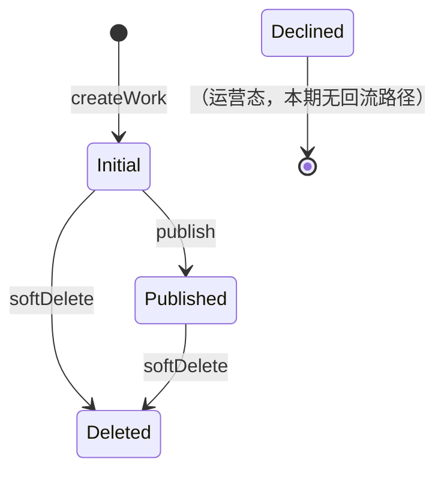

## Work 作品业务模型与权限规则（2026-06）

> 目标读者：接手 `work` 模块的同学，包括但不限于编辑器、模板广场、运营后台。
> 本文目标：把"作品状态 / 可见性 / 模板 / 渠道"四件事的业务规则、数据约束和权限边界讲清楚，
> 让你在写新功能、改字段、查 bug 时知道哪些是产品规则、哪些是数据完整性约束、哪些是权限约束。

---

### 1) 业务模型概览

一个 **Work（作品）** 就是用户在编辑器里搭出来的一个 H5 页面。它有四类核心信息：

| 维度 | 字段 | 说明 |
|---|---|---|
| 内容 | `title / desc / coverImg / content` | 作品本身的内容 |
| 生命周期 | `status` | 作品的状态（草稿 / 发布 / 删除 / 强制下线） |
| 可见性 | `isPublic / isTemplate` | 别人能不能看到、是否进入模板区 |
| 投放 | `channels[]` | 同一个发布页对应多个带渠道号的 URL，用于分渠道统计 |

数据 schema 见 `packages/craft-backend/src/database/mongo/schema/work.schema.ts`。

---

### 2) 状态机：`status`

```ts
enum WorkStatusEnum {
  Deleted = 0,    // 软删除
  Initial = 1,    // 草稿（未发布）
  Published = 2,  // 已发布
  Declined = 3,   // 强制下线（运营操作）
}
```

#### 2.1 状态流转



#### 2.2 关键约束

- **`publish` 仅允许 `Initial → Published`**，没有"重新发布"路径。
  作品发布后继续编辑保存（`update`）不会改变状态，也不会重置 `latestPublishAt`。
- **删除是软删除**：`status=Deleted` 后，所有读取路径都用 `{ status: { $ne: Deleted } }` 过滤。
- **`Declined` 由运营/后台触发**，编辑器侧本期不感知。
- **H5 渲染（`/work/pages/:id/:uuid`）只看 `status=Published`**，跟 `isPublic / isTemplate` 完全无关。

---

### 3) 可见性两个独立维度：`isPublic / isTemplate`

这两个字段是**正交的**，任何组合都合法，但语义不同：

| isPublic | isTemplate | 谁能看 | 是否能被复制 | 是否出现在"模板区"列表 |
|:-:|:-:|---|:-:|:-:|
| false | false | 仅作者本人 | ❌ | ❌ |
| true  | false | 任何登录用户 | ✅ | ❌ |
| false | true  | 仅作者本人 | ❌ | 仅出现在「我的模版」 |
| true  | true  | 任何登录用户 | ✅ | 出现在「我的模版」+「公共模板区」 |

> 一句话理解：
> - **`isPublic` 控制"能不能被别人看到/复制"**
> - **`isTemplate` 控制"是不是作为模板列出"**

#### 3.1 数据完整性约束（全局生效，admin 也不能绕过）

1. **`isPublic=true` 要求 `status=Published`**。
   原因：未发布的作品在 H5 渲染、列表展示等任何对外路径上都不可见，「公开」对它没有任何业务意义。
2. **`isTemplate=true` 要求 `status=Published`**。
   原因同上：模板的唯一目的是被复制，未发布的"模板"既无法预览也无法被复制。
3. **`isTemplate` 一旦为 `true`，不可改回 `false`**。
   原因：业务上"取消模板"会让已经依赖该模板的下游链路（例如收藏、引用列表）失去目标，
   且模板本身就是一份"声明性的副本"，撤销没有合理的产品语义。

这些约束在 `WorkService` 层强校验，不依赖角色（包括 admin）。

#### 3.2 写入入口（仅这三个，不许走 update）

| 接口 | 作用 | 关键约束 |
|---|---|---|
| `POST /work/publish` | `Initial → Published` | 仅允许该方向，幂等失败 |
| `POST /work/publishTemplate` | 置 `isTemplate=true` | 必须 `Published`、且当前 `isTemplate !== true` |
| `POST /work/setPublic` | 切换 `isPublic` | 必须 `Published`（无论目标 true/false） |

> ⚠️ **不要在 `POST /work/update` 里改 `isPublic / isTemplate`**。`update` 接口设计上只负责改作品内容（`title/desc/coverImg/content`），可见性字段全部由专用接口管理，避免一个接口承担多种语义导致的权限/校验复杂度。
>
> ⚠️ **不要在 `POST /work/create` 里传 `isPublic / isTemplate`**。新建作品状态为 `Initial`，传这两个字段必定违反约束 3.1，因此 `CreateDto` 直接不暴露这两个字段。

---

### 4) 权限规则：CASL Ability

定义见 `packages/craft-backend/src/module/work/casl/work-ability.factory.ts`。

#### 4.1 角色能力矩阵

| 动作 | normal | admin |
|---|---|---|
| `create` Work | ✅ | ✅ |
| `read` Work（详情） | 自己的作品 ∪ `isPublic=true` 的作品 | 全部 |
| `update` Work（含 setPublic） | 仅作者本人 | 全部 |
| `publish` Work | 仅作者本人 | 全部 |
| `publishTemplate` Work | 仅作者本人 | 全部 |
| `delete` Work（软删除） | 仅作者本人 | ❌（admin 不允许删除作品） |
| `manageChannels` Work | 仅作者本人 | 全部 |

注意点：

- 「读取公开作品」是通过 `can(Read, 'Work', { isPublic: true })` 实现的。**结合 3.1 的约束（`isPublic=true` 必有 `status=Published`）**，等价于"任何登录用户可读已公开发布的作品"。
- **admin 故意被剥夺 `delete` 权限**，避免误操作。
- `setPublic` 路由在 controller 上声明的 CASL action 是 `Update`（不单独拆 `SetPublic`）—— 能改作品的人就能改它的可见性，权限边界一致。

#### 4.2 权限校验时机

`WorkPolicyGuard`（`packages/craft-backend/src/module/work/casl/work-policy.guard.ts`）在 controller 路由上通过 `@WorkPolicy(action, idFrom, idKey, errorKey)` 装饰器声明。Guard 会：

1. 从 request 的 body/query/params 中取出 work id；
2. 走 `findWorkByIdOrThrow` 拿到 work（自动过滤软删除）；
3. 把 `work.user` 归一化为 string，喂给 CASL `ability.can(...)`；
4. 失败时按声明的 `errorKey` 抛 `BizException`。

---

### 5) 渠道（Channel）业务

#### 5.1 什么是渠道，为什么需要

渠道就是**一个加在 H5 URL 上的唯一标识**，用来区分同一个作品在不同投放位置的统计数据。

举例：一个 H5 发布出去的 URL 是 `xxx/index.html`，但要同时投放到微信、头条、支付宝。运营要看的不只是总数据，更要看"哪个投放位置效果好"。
解决方式就是：

- 创建一个名叫"微信"的渠道 → URL 变成 `xxx/index.html?channel=aaa`
- 创建一个名叫"支付宝"的渠道 → URL 变成 `xxx/index.html?channel=bbb`

然后在不同地方投放对应的链接，统计时按 `channel` 参数分组即可。

> - 渠道名（`name`）：**中文**，给运营看的可读名，可重命名。
> - 渠道号（`id`）：**uuid（`nanoid(6)`）**，用作 URL 上的 `?channel=` 值，不可重复、不可改。

数据存储：作品文档上的 `channels: WorkChannel[]`，每项 `{ id, name }`。

#### 5.2 业务规则

| # | 规则 | 说明 |
|---|---|---|
| 1 | 渠道名不能跟同一作品下的已有渠道重复 | 在 `WorkChannelService.assertNoDuplicateChannelNameOrThrow` 中校验 |
| 2 | 至少保留一个渠道 | 不能把最后一个渠道删掉 |
| 3 | 渠道操作必须是作者本人 | CASL `ManageChannels`，admin 也允许 |
| 4 | 渠道号自动生成（`nanoid(6)`），不重复且不可修改 | 只能改 `name` |

#### 5.3 前端业务行为（后端不感知，但实现时必须保证）

下面这些是**前端业务行为**，后端没有强制约束（也无须感知），但前端实现时务必保证，否则会破坏运营统计的连续性：

- **初次发布作品时，前端要默认创建一个名为"默认"的渠道**（业务约定，让作品发布后立刻有一个可投放的链接）。
- **作品保存/再次"发布"时，现有渠道列表不能丢失，且渠道号（uuid）不能变**。
  - 原因：渠道号已经印在外部投放的 URL 上，一旦变化，所有历史投放统计就断链。
  - 渠道**名称可以改**（运营调整命名），但 id 永远稳定。
- 渠道增删改请直接调 `POST /work/channel/{create|update|delete}` 接口，**不要试图通过 `update` 把整个 `channels` 数组覆盖回去**。

---

### 6) 关键错误码

定义见 `packages/craft-backend/src/common/error/work.error.ts`。常见误用排查：

| errno | key | 含义 | 触发场景示例 |
|---|---|---|---|
| 102002 | `workNoPermissonFail` | 没有权限 | 非作者去 update / publish 别人的作品 |
| 102003 | `workNoPublicFail` | 该作品未公开 | 非作者去查别人的私有作品详情 |
| 102006 | `workNotExistError` | 作品不存在 | id 错 / 已软删除 |
| 102007 | `workStatusTransferFail` | 作品状态不允许该操作 | `Initial` 调 setPublic / publishTemplate；非 `Initial` 调 publish |
| 102008 | `workAlreadyTemplateFail` | 已经是模板不能重复发布 | 模板设置后再次 publishTemplate |
| 102009 | `channelDuplicateFail` | 渠道名重复 | createChannel/updateChannelName 时同名 |

> `workStatusTransferFail` 是统一的"状态不允许"错误，setPublic 失败和 publish 失败都会复用，前端按错误码做提示即可，不需要细分。

---

### 7) TODO / 已知缺口

- **公共模板广场列表接口**（未实现）。
  schema 注释里提到「模板会在首页模板区显示」，但目前 controller 上**没有任何接口**能让别人列出公开模板。
  待补：`GET /work/templates?page=&pageSize=&sortBy=&title=`，按 `{ isTemplate: true, isPublic: true, status: Published }` 过滤。
- **复制模板**（未实现）。前端 `useFetchWork.ts` 在识别到"他人的公开模版"时弹出「复制一份」提示，但实际复制逻辑是 TODO。
- **`Declined` 状态的运营回流路径**（未实现）。当前 admin 工具链不暴露该状态的写操作，只在 schema 里占位。

---

### 8) 关键文件索引

后端：

- Schema：`packages/craft-backend/src/database/mongo/schema/work.schema.ts`
- Controller：`packages/craft-backend/src/module/work/work.controller.ts`
- Service：
  - `packages/craft-backend/src/module/work/work.service.ts`（作品本体）
  - `packages/craft-backend/src/module/work/workChannel.service.ts`（渠道）
  - `packages/craft-backend/src/module/work/workToH5.service.ts`（H5 渲染）
- DTO：`packages/craft-backend/src/module/work/dto/*.ts`
- CASL：`packages/craft-backend/src/module/work/casl/*.ts`
- 错误码：`packages/craft-backend/src/common/error/work.error.ts`
- HTTP 测试：`packages/craft-backend/test/http/4.work.http`

前端：

- API：`packages/craft/src/api/modules/work.ts`
- 进入编辑器：`packages/craft/src/hooks/useFetchWork.ts`
- 编辑器状态：`packages/craft/src/stores/editor.ts`

相关文档：

- SSR 与 Hydration：`BizDocs/06-作品发布页SSR与Hydration流程.md`
