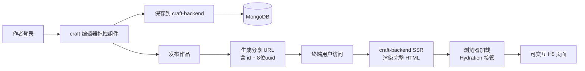

[](https://github.com/tyler4400/my-lego/actions/workflows/test.yml)
[](https://github.com/tyler4400/my-lego/actions/workflows/lint.yml)

# my-lego

一个**低代码 H5 活动页面搭建平台**——用户可以在浏览器里像搭乐高积木一样拖拽组件、调样式，一键发布得到一个可分享的 H5 落地页。

> 本项目源自慕课网课程 [《从 0 实现乐高活动平台（Vue3 + Node）》](https://coding.imooc.com/class/824.html)，但在课程基础上做了大量现代化改造（Egg → NestJS、Webpack → Vite、加入 SSR + Hydration、引入 CASL 权限、ESLint 9 flat config、pnpm monorepo 等）。

---

## 1. 这是个什么平台

把它想象成**“给运营/市场同学用的简易 H5 编辑器”**：

- 用户登录后，可以在画布上拖拽 `LText / LImage` 等组件，调整位置、样式、动作。
- 内容自动保存为一份 `work.content` 数据存到数据库。
- 点“发布”后，作品获得一个分享 URL（含 8 位短 uuid，避免被遍历）。
- 终端用户/扫码者通过分享 URL 访问 → 后端 SSR 出完整 HTML → 浏览器水合接管 → 看到一个可交互的 H5 页面。
- 作者还可以把作品设为“模板”供其他人复用，或开多个“渠道”做分渠道投放统计。
- 运营/管理员通过 **`craft-admin` 后台**管理用户、模板与海报等运营能力（与 C 端编辑器、`craft-backend` 并列部署）。

---

## 2. 业务总览

### 2.1 核心实体：Work（作品）

一个 Work 就是用户搭出来的一个 H5 页面，主要包括四个维度的字段：

| 维度 | 字段 | 说明 |
| --- | --- | --- |
| 内容 | `title / desc / coverImg / content` | 作品本身 |
| 生命周期 | `status` | 草稿 / 已发布 / 软删除 / 强制下线 |
| 可见性 | `isPublic / isTemplate` | 别人能不能看、是否进入模板区 |
| 投放 | `channels[]` | 同一个发布页 + 多个渠道号 URL，用于分渠道统计 |

详细业务规则（状态机、可见性矩阵、模板规则）见 [BizDocs/07](./BizDocs/07-Work作品业务模型与权限规则.md)。

### 2.2 核心链路：从拖拽到分享



### 2.3 关键能力清单

- **认证与登录**：手机号 + 邮箱 + GitHub OAuth2 第三方登录（含完整接入流程，见 [BizDocs/05](./BizDocs/05-Github%20OAuth2联合登录流程（curosr_chat）.md)）。
- **作品 CRUD + 权限**：基于 CASL 的细粒度权限（作者本人 / 公开作品 / 管理员）。
- **作品发布与分享**：发布后产出 `id + 短 uuid`，通过 `/api/v1/work/pages/:id/:uuid` 访问。
- **SSR + Hydration**：后端用 Vue SSR 渲染首屏 HTML，客户端水合接管，详见 [BizDocs/06](./BizDocs/06-作品发布页SSR与Hydration流程.md)。
- **模板广场**：把作品标记为模板后，其他用户可以一键复制作为起点。
- **渠道管理**：为同一个作品创建多个渠道（如“微信投放 / 朋友圈 / 短信”），用于运营分渠道统计。
- **资源上传**：用户上传图片走运行时上传目录，与发布静态资源分离。
- **运营后台（craft-admin）**：Nuxt 4 全栈管理端，独立 MongoDB 库 + JWT Cookie 登录；已实现用户列表与认证，模板/海报运营能力持续建设中。

---

## 3. 仓库结构与子包

本仓库使用 **pnpm monorepo** 管理：

```text
my-lego/
├── packages/
│   ├── shared/         # @my-lego/shared        共享工具/类型库（前后端共用）
│   ├── craft/          # @my-lego/craft         前端：编辑器 SPA + SSR 子模块
│   ├── craft-backend/  # @my-lego/craft-backend 后端：NestJS 业务 + SSR 渲染
│   └── craft-admin/    # @my-lego/craft-admin   运营后台：Nuxt 4 全栈（Nitro API + 管理页）
├── BizDocs/            # 业务/架构文档
├── docs/imooc/         # 课程实践笔记（含 craft-admin 第 21 章）
├── pnpm-workspace.yaml
├── tsconfig.base.json  # 统一 TS 严格规则与路径别名
├── eslint.base.mjs     # 统一 ESLint flat config（含 Prettier 集成）
└── package.json        # 根脚本
```

### 3.1 子包速查

| 包名 | 路径 | 角色 | README |
| --- | --- | --- | --- |
| `@my-lego/shared` | `packages/shared/` | 共享工具/类型（`createSafeJson` / `hashPassword` / `isString` 等） | — |
| `@my-lego/craft` | `packages/craft/` | 前端编辑器（Vue 3 + Vite）+ SSR 子模块（一份源码三种产物） | [README](./packages/craft/README.md) |
| `@my-lego/craft-backend` | `packages/craft-backend/` | 后端（NestJS 11 + Mongoose + Redis + JWT/CASL）+ 发布页 SSR 渲染 | [README](./packages/craft-backend/README.md) |
| `@my-lego/craft-admin` | `packages/craft-admin/` | 运营后台（Nuxt 4 + Nuxt UI + MongoDB + JWT Cookie） | [README](./packages/craft-admin/README.md) |

### 3.2 包之间的依赖关系

```mermaid
flowchart LR
  Shared[@my-lego/shared<br/>工具/类型]
  Craft[@my-lego/craft<br/>编辑器 + SSR 子模块]
  Backend[@my-lego/craft-backend<br/>NestJS 业务 + 发布页 SSR]
  Admin[@my-lego/craft-admin<br/>Nuxt 4 运营后台]

  Shared --> Craft
  Shared --> Backend
  Shared --> Admin
  Craft -.exports './ssr'.-> Backend
```

> 关键点：`craft-backend` 依赖 `craft` 暴露的 `./ssr` 子入口（`dist-ssr/index.cjs`），用来渲染发布页 HTML。详见 [BizDocs/06 §3](./BizDocs/06-作品发布页SSR与Hydration流程.md)。
>
> `craft-admin` 与 `craft-backend` **独立进程、独立 MongoDB 库**，通过 `@my-lego/shared` 复用密码等工具；运营侧 `admin` 角色与作品 CASL 规则见 [BizDocs/07](./BizDocs/07-Work作品业务模型与权限规则.md)。

---

## 4. 快速开始

### 4.1 前置依赖

- **Node** ≥ 20.19 或 ≥ 22.12
- **pnpm**（推荐用 corepack：`corepack enable && corepack prepare pnpm@latest --activate`）
- **MongoDB** ≥ 6（`craft-backend` 与 `craft-admin` 各用独立库）
- **Redis** ≥ 6（`craft-backend` 用，做 token/缓存；`craft-admin` 当前不需要）

### 4.2 安装与启动

```bash
# 1) 安装所有依赖（pnpm workspace 会软链 packages 之间的本地包）
pnpm install

# 2) 配置后端 env（首次运行）
cp packages/craft-backend/.env-example packages/craft-backend/.env
# 编辑 .env，填好 MongoDB / Redis / JWT_SECRET / RUNTIME_DATA_ROOT_PATH 等

# 3) 一次性把后端运行所需的所有产物 build 好（含 craft 的 SSR/H5 产物）
pnpm -C packages/craft-backend build

# 4) 配置 craft-admin env（可选，跑后台时）
cp packages/craft-admin/.env.example packages/craft-admin/.env
# 编辑 NUXT_MONGOOSE_URI、NUXT_JWT_SECRET

# 5) 启动 dev
pnpm dev:craft           # 编辑器（http://localhost:5173）
pnpm dev:craft-backend   # 后端（http://localhost:3000）
pnpm dev:craft-admin     # 运营后台（http://localhost:3003）
```

> 重要：第一次启动 `craft-backend` 前必须先跑过一次 step 3。craft-backend dev 模式不会自动 build craft 的 SSR/H5 产物，缺了产物会报 `manifest.json: 的资源不存在`。详细原因见 [BizDocs/06 §6](./BizDocs/06-作品发布页SSR与Hydration流程.md)。
>
> `craft-admin` 不依赖 craft 的 SSR/H5 产物，配置好 `.env` 后即可单独启动。

### 4.3 全仓脚本

| 脚本 | 作用 |
| --- | --- |
| `pnpm build` | 全仓串行构建（`pnpm -r run build`） |
| `pnpm lint` | 全仓 ESLint（含 Prettier 格式检查） |
| `pnpm lint:fix` | 全仓自动修复 |
| `pnpm format` | 全仓 Prettier 格式化 |
| `pnpm dev:craft` | 启动 craft 编辑器 dev server |
| `pnpm dev:craft-backend` | 启动 craft-backend dev server（watch 模式） |
| `pnpm dev:craft-admin` | 启动 craft-admin 开发服务（Nuxt，端口 3003） |
| `pnpm test:craft` | 运行 craft 的单测（Vitest） |

子包级别的脚本（`build:h5 / build:ssr / start:prod` 等）见各自子包 README。

---

## 5. 技术栈速览

### 5.1 前端（@my-lego/craft）

- **框架**：Vue 3.5（含 TSX 支持）
- **构建**：Vite 7（三套配置：SPA / SSR lib / H5 client）
- **状态**：Pinia 3
- **路由**：Vue Router 4
- **UI**：ant-design-vue 4
- **拖拽**：vue-draggable-plus
- **工具**：@vueuse/core / lodash-es / hotkeys-js / mitt / html2canvas / cropperjs / qrcode

### 5.2 后端（@my-lego/craft-backend）

- **框架**：NestJS 11（Express 平台）
- **DB**：Mongoose 8（含自增 id 插件）
- **缓存**：ioredis 5
- **鉴权**：Passport-JWT + 自定义 CASL ability
- **模板**：hbs（用于 SSR 发布页 HTML 拼装）
- **校验**：class-validator + class-transformer
- **日志**：Winston + winston-daily-rotate-file
- **图片处理**：sharp
- **静态服务**：@nestjs/serve-static（双挂载：发布静态 + 运行时上传）

### 5.3 运营后台（@my-lego/craft-admin）

- **框架**：Nuxt 4（Nitro Server API + Vue 页面一体）
- **UI**：Nuxt UI v4 + Tailwind CSS v4
- **DB**：MongoDB + nuxt-mongoose
- **鉴权**：JWT + `httpOnly` Cookie（`defineAuthResponseHandler` 显式保护 API）
- **表单**：VeeValidate + Zod（`shared/validators` 前后端共用）

详见 [craft-admin README](./packages/craft-admin/README.md)；实现过程见 `docs/imooc/21-*`。

### 5.4 工程化

- **Monorepo**：pnpm workspace
- **TS**：根 `tsconfig.base.json` + 子包 thin 配置
- **Lint/Format**：ESLint 9 flat config + Prettier（集成为 ESLint rule）
- **CI**：GitHub Actions（test + lint）

---

## 6. 文档目录

仓库的所有架构/业务文档都在 [`BizDocs/`](./BizDocs/) 下，建议按编号顺序阅读：

| 编号 | 文档 | 主题 |
| --- | --- | --- |
| 01 | [Monorepo 项目搭建指南](./BizDocs/01-my-lego%20Monorepo%20项目搭建指南.md) | 仓库脚手架决策、TS/ESLint/Prettier/Vite alias 统一方案 |
| 02 | [WebStorm HTTP 客户端 OAuth 授权](./BizDocs/02-WebStorm%20HTTP%20客户端%20OAuth%20授权.md) | 用 IDEA HTTP Client 调试 JWT 接口的工程实践 |
| 03 | [SSR 接口前端组件集成](./BizDocs/03-SSR%20接口前端组件集成（cursor_chat）.md) | SSR 方案设计的完整决策过程（cursor chat 记录） |
| 05 | [GitHub OAuth2 联合登录流程](./BizDocs/05-Github%20OAuth2联合登录流程（curosr_chat）.md) | OAuth2 接入决策、模块拆分、安全细节 |
| 06 | [**作品发布页 SSR 与 Hydration 流程**](./BizDocs/06-作品发布页SSR与Hydration流程.md) | **最重要**：从打包配置 → 请求链路 → Hydration 全链路详解（推荐所有新人必读） |
| 07 | [Work 作品业务模型与权限规则](./BizDocs/07-Work作品业务模型与权限规则.md) | 状态机、可见性、模板、渠道、CASL 权限边界 |

---

## 7. 贡献与协作

- 提交前请确保 `pnpm lint` 和 `pnpm test:craft` 通过。
- 提交信息建议遵循 [Conventional Commits](https://www.conventionalcommits.org/zh-hans/)。
- 涉及业务规则变更（状态机、权限、字段语义）请同步更新对应 BizDocs。
- 涉及 SSR 链路变更（craft 的 SSR 子模块 / vite 配置 / craft-backend 的 WorkToH5Service）请仔细对照 [BizDocs/06](./BizDocs/06-作品发布页SSR与Hydration流程.md) 的"高频问题清单"自测。

---

## 8. License

ISC（仅作学习用途，未授权用于生产环境）。
