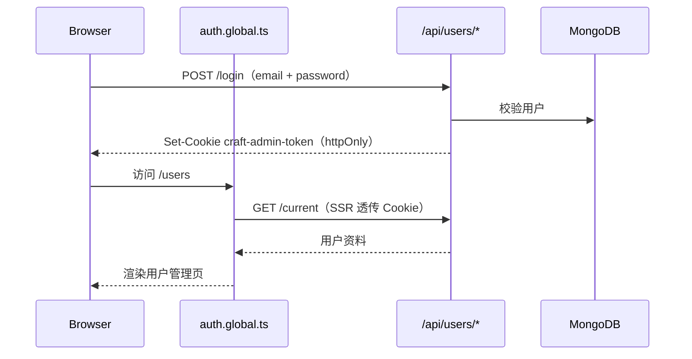

# @my-lego/craft-admin

低代码 H5 平台的**运营管理后台**：基于 **Nuxt 4 全栈**构建，前后端一体（Nitro Server API + Vue 页面），供运营/管理员进行用户管理、模板与海报运营等后台操作。

> 本包是 `my-lego` monorepo 的子包，请先阅读 [根 README](../../README.md) 了解整体业务再回来看这里的细节。

---

## 1. 这个包是干什么的

`@my-lego/craft-admin` 与 `@my-lego/craft`（作者编辑器）、`@my-lego/craft-backend`（C 端业务 + 发布页 SSR）**并列存在**，职责分离：

| 子包 | 面向谁 | 核心职责 |
| --- | --- | --- |
| `craft` | 内容创作者 | 拖拽搭建 H5 作品、发布分享 |
| `craft-backend` | 终端用户 + 编辑器 API | 作品 CRUD、OAuth2、发布页 SSR |
| **`craft-admin`** | **运营 / 管理员** | **后台登录、用户列表、模板/海报运营（规划中）** |

当前已实现的能力：

- **认证**：邮箱注册 / 登录 / 登出，JWT 写入 `httpOnly` Cookie
- **登录态**：全局路由中间件 + `useCurrentUser` 内存态，支持 SSR 首屏鉴权
- **用户管理**：分页列表、关键词搜索、排序、角色展示（`normal` / `admin`）
- **后台布局**：`default`（Header + Sidebar）与 `empty`（登录/注册无骨架）

占位页面（侧边栏已挂路由，功能待实现）：`/templates`、`/posters`。

---

## 2. 在 monorepo 中的位置

```mermaid
flowchart LR
  Shared[@my-lego/shared<br/>工具/类型/crypto]
  Craft[@my-lego/craft<br/>编辑器 SPA + SSR]
  Backend[@my-lego/craft-backend<br/>NestJS 业务 + 发布页 SSR]
  Admin[@my-lego/craft-admin<br/>Nuxt 4 全栈后台]

  Shared --> Craft
  Shared --> Backend
  Shared --> Admin
  Craft -.exports './ssr'.-> Backend
```

要点：

- `craft-admin` **独立运行**自己的 Nitro 服务（默认端口 **3003**），使用**独立 MongoDB 库**（见 `.env.example` 的 `craft-admin` 库名），与 `craft-backend` 不共用进程。
- 密码 hash/verify 复用 `@my-lego/shared` 的 `hashPassword` / `verifyPassword`（`bcryptjs`），与课程里在 admin 内直接装 `bcrypt` 的做法不同。
- 开发时通过 `nuxt.config.ts` 的 **alias 源码直连** `@my-lego/shared`，改 shared 无需先 build。Monorepo 接入方式见 [BizDocs/01](../../BizDocs/01-my-lego%20Monorepo%20项目搭建指南.md)。

与 C 端权限模型的关系：作品侧的 CASL 规则（含 `admin` 角色对 Work 的边界）见 [BizDocs/07](../../BizDocs/07-Work作品业务模型与权限规则.md)。`craft-admin` 的用户 `role` 字段为后续对接运营能力预留。

---

## 3. 技术栈

| 类别 | 技术 |
| --- | --- |
| 框架 | Nuxt 4（Vue 3.5 + Nitro） |
| UI | Nuxt UI v4（Reka UI + Tailwind v4） |
| 样式 | Tailwind CSS v4（由 `@nuxt/ui` 集成，无需手动 `@tailwindcss/vite`） |
| 表单校验 | VeeValidate 4 + `@vee-validate/zod` |
| Schema | Zod 4（前后端共享 `shared/validators/`） |
| 数据库 | MongoDB + `nuxt-mongoose` |
| 鉴权 | `jsonwebtoken` + `httpOnly` Cookie |
| 工具 | dayjs、`@my-lego/shared` |

**Node 要求**：与仓库一致，≥ 20.19 或 ≥ 22.12。

---

## 4. 目录结构

```text
packages/craft-admin/
├── app/                      # Nuxt 4 默认 srcDir（页面/组件/布局）
│   ├── app.vue               # 根组件：<NuxtLayout> + <NuxtPage>
│   ├── assets/css/main.css   # Tailwind 入口
│   ├── components/           # GlobalHeader、Sidebar、ValidateInput…
│   ├── composables/          # useCurrentUser
│   ├── layouts/              # default（后台骨架）/ empty（认证页）
│   ├── middleware/           # auth.global.ts 全局登录校验
│   └── pages/                # 路由页面
├── server/
│   ├── api/users/            # REST 风格 Nitro 路由
│   ├── middleware/           # 1.log.ts 请求日志
│   ├── models/               # Mongoose User 模型
│   ├── test/                 # HTTP Client 调试文件
│   └── utils/                # jwt、authHandler、runValidate
├── shared/                   # 前后端共用（自动导入 #shared/*）
│   ├── types/
│   └── validators/
├── nuxt.config.ts
├── .env.example
└── package.json
```

> Nuxt 4 约定：课程里常见的根级 `pages/`、`layouts/` 在本项目中均在 **`app/`** 下。详见 `docs/imooc/21-*` 系列笔记。

---

## 5. 认证与请求链路

### 5.1 登录态流转



### 5.2 与课程实现的差异（工程化）

| 维度 | 课程（Nuxt 3 admin） | craft-admin |
| --- | --- | --- |
| 鉴权方式 | 全局 server 中间件 + 路径正则 | **`defineAuthResponseHandler` 高阶函数**，需登录的 API 显式包装 |
| 密码 | 项目内 `bcrypt` | **`@my-lego/shared` + bcryptjs** |
| Cookie | 基础选项 | **`httpOnly` + `secure`（生产）+ `sameSite`** |
| UI | Nuxt UI v2 | **Nuxt UI v4**（组件 API 有变，以 [ui.nuxt.com](https://ui.nuxt.com) 为准） |

需要登录的接口示例：`current.get.ts`、`users/index.ts`、`users/[id].patch.ts`。公开接口：`login.post.ts`、`signup.post.ts`；`logout.post.ts` 仅清 Cookie，不强制校验 token。

---

## 6. API 速查

| 方法 | 路径 | 鉴权 | 说明 |
| --- | --- | --- | --- |
| `POST` | `/api/users/signup` | 否 | 邮箱注册 |
| `POST` | `/api/users/login` | 否 | 登录，签发 JWT Cookie |
| `POST` | `/api/users/logout` | 否 | 清除 Cookie |
| `GET` | `/api/users/current` | 是 | 当前登录用户 |
| `GET` | `/api/users` | 是 | 用户分页列表（keyword / orderBy / order） |
| `PATCH` | `/api/users/:id` | 是 | 更新用户（如角色） |

本地调试可用 `server/test/test.http`（配合 WebStorm / IDEA HTTP Client），OAuth/JWT 调试思路也可参考 [BizDocs/02](../../BizDocs/02-WebStorm%20HTTP%20客户端%20OAuth%20授权.md)。

---

## 7. 页面路由

| 路径 | 布局 | 状态 |
| --- | --- | --- |
| `/` | `default` | 首页（展示当前用户） |
| `/login` | `empty` | 登录 |
| `/signup` | `empty` | 注册 |
| `/users` | `default` | 用户管理（表格 + 搜索 + 分页） |
| `/templates` | `default` | 占位，待实现 |
| `/posters` | `default` | 占位，待实现 |

---

## 8. 快速开始

### 8.1 前置依赖

- **Node** ≥ 20.19 或 ≥ 22.12
- **pnpm**（仓库根已配置 workspace）
- **MongoDB** ≥ 6（本包独立库，默认 `mongodb://localhost:27017/craft-admin`）

### 8.2 安装与启动

```bash
# 在仓库根目录
pnpm install

# 配置环境变量（首次）
cp packages/craft-admin/.env.example packages/craft-admin/.env
# 编辑 NUXT_MONGOOSE_URI、NUXT_JWT_SECRET

# 启动开发服务 → http://localhost:3003
pnpm dev:craft-admin
```

`nuxt prepare` 会在 `postinstall` 时自动执行，生成 `.nuxt/types/imports.d.ts` 等类型文件；IDE 才能识别 `useState`、`useFetch` 等自动导入。

### 8.3 常用脚本

| 脚本 | 作用 |
| --- | --- |
| `pnpm dev` | 开发模式（端口 3003） |
| `pnpm build` | 生产构建（`.output/`） |
| `pnpm preview` | 预览生产构建 |
| `pnpm lint` / `pnpm lint:fix` | ESLint（antfu flat config） |

根目录等价命令：`pnpm dev:craft-admin`、`pnpm lint`（`-r` 会包含本包）。

---

## 9. 环境变量

| 变量 | 说明 |
| --- | --- |
| `NUXT_MONGOOSE_URI` | MongoDB 连接串（`nuxt-mongoose` 自动读取） |
| `NUXT_JWT_SECRET` | 覆盖 `runtimeConfig.jwt.secret` |

`runtimeConfig` 中还可配置 `jwt.expiresIn`（默认 3600 秒）、`jwt.cookieName`（默认 `craft-admin-token`）、`bcrypt.saltRounds`（默认 10）。详见 `nuxt.config.ts`。

---

## 10. 相关文档

### BizDocs（仓库级架构 / 业务）

| 文档 | 与本包的关系 |
| --- | --- |
| [01 Monorepo 搭建指南](../../BizDocs/01-my-lego%20Monorepo%20项目搭建指南.md) | workspace、alias、lint 统一方案 |
| [02 HTTP Client 授权调试](../../BizDocs/02-WebStorm%20HTTP%20客户端%20OAuth%20授权.md) | 调试需登录 API 的实践 |
| [07 Work 业务模型与权限](../../BizDocs/07-Work作品业务模型与权限规则.md) | `admin` 角色与作品权限边界（后续运营功能对接） |

### 课程实践笔记（`docs/imooc/21-*`）

按章节记录了从脚手架到用户表格的完整实现过程，与课程 Nuxt 3 版本的对照差异：

| 章节 | 主题 |
| --- | --- |
| [21-0](../../docs/imooc/21-0-初始化craft-admin项目.md) | monorepo 内初始化 Nuxt 4 |
| [21-1](../../docs/imooc/21-1-安装tailwindcss.md) | Tailwind v4 接入 |
| [21-3](../../docs/imooc/21-3-使用Layouts创造两种布局.md) | `default` / `empty` 布局 |
| [21-5~9](../../docs/imooc/21-5_6-Zod完成前后端验证.md) | Zod + VeeValidate |
| [21-11~12](../../docs/imooc/21-11_12-注册登录后端与JWT.md) | 注册登录 API + JWT |
| [21-13~14](../../docs/imooc/21-13_14-前端用户验证与登录态持久化.md) | 全局中间件与登录态 |
| [21-16~18](../../docs/imooc/21-16_17_18-NuxtUI与后台布局.md) | Nuxt UI v4 与后台骨架 |
| [21-19~23](../../docs/imooc/21-19_20_21-Table展示分页排序.md) | 用户表格分页排序 |

---

## 11. 开发备忘

- **端口**：`3003`，刻意避开 `craft-backend`（3000）与 `craft` 编辑器（5173）。
- **自动导入**：`shared/` 下类型与 validator、`composables/`、`components/` 均参与 Nuxt 自动导入；改 `nuxt.config.ts` 或新增目录后若类型丢失，重启 dev 或执行 `nuxt prepare`。
- **SSR 鉴权**：`auth.global.ts` 在服务端通过 `useRequestHeaders(['cookie'])` 把 Cookie 传给 `/api/users/current`，因为 `httpOnly` Cookie 无法在客户端 JS 中读取。
- **不要**把本包加入根 `tsconfig.json` 的 `references`——与 `craft-backend` 相同，Nuxt 使用独立的 `.nuxt/tsconfig.*.json` 类型体系。

---

## 12. License

ISC（仅作学习用途，未授权用于生产环境）。
