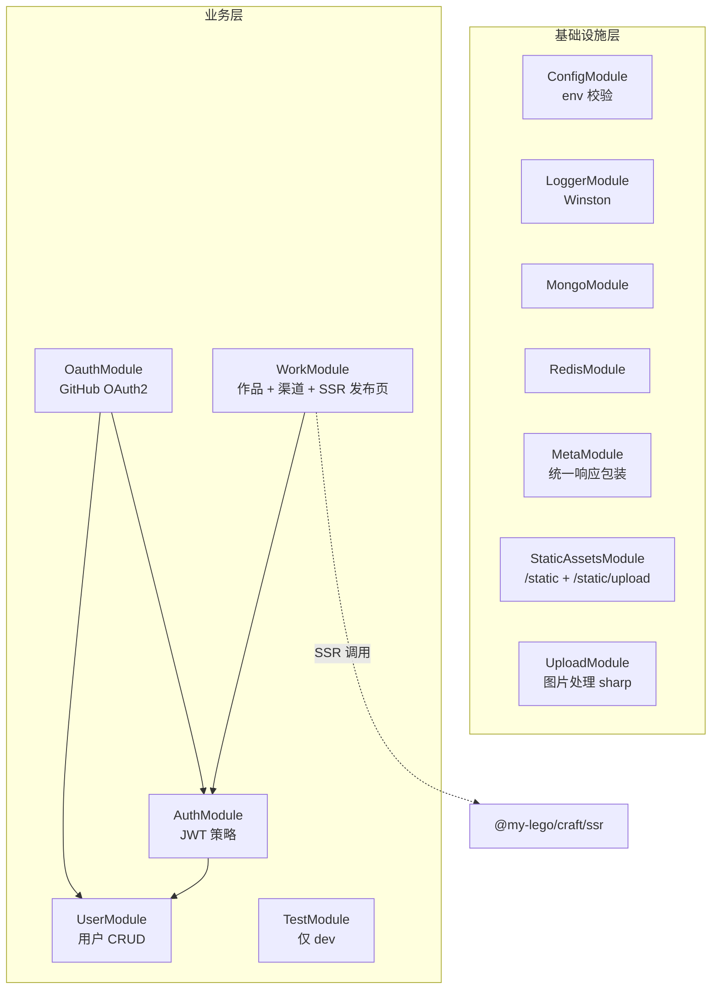
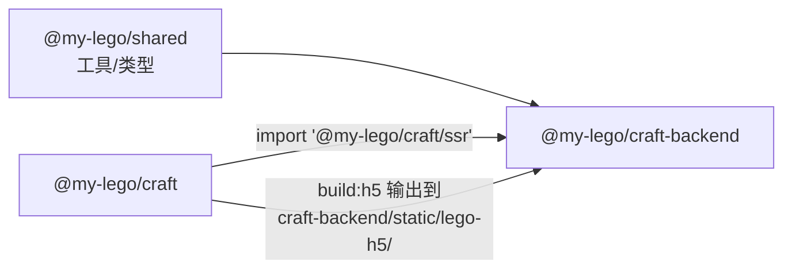

# @my-lego/craft-backend

低代码 H5 平台的后端服务：基于 **NestJS 11** 构建，承担**业务接口**（鉴权、作品 CRUD、上传等）+ **作品发布页 SSR 渲染** 两大职责。

> 本包是 `my-lego` monorepo 的子包，请先阅读 [根 README](../../README.md) 了解整体业务再回来看这里的细节。

---

## 1. 这个包是干什么的

`@my-lego/craft-backend` 同时承担两类任务：

1. **业务后端**：用户认证（手机/邮箱/GitHub OAuth2）、作品 CRUD、模板/渠道管理、上传、CASL 权限控制等。
2. **SSR 渲染服务**：导入 `@my-lego/craft/ssr` 暴露的渲染函数，把 `work.content` 渲染成 HTML，结合 hbs 模板拼成完整发布页吐给浏览器。

---

## 2. 模块全景

### 2.1 模块依赖图



### 2.2 业务模块速查

| 模块 | 路径 | 主要职责 |
| --- | --- | --- |
| **AuthModule** | `src/module/auth/` | JWT 策略 + Guard，token 签发/校验 |
| **OauthModule** | `src/module/oauth/` | GitHub OAuth2 第三方登录（详见 [BizDocs/05](../../BizDocs/05-Github%20OAuth2联合登录流程（curosr_chat）.md)） |
| **UserModule** | `src/module/user/` | 用户注册/登录（手机+邮箱）、信息维护 |
| **WorkModule** | `src/module/work/` | 作品 CRUD + 模板 + 渠道 + **作品发布页 SSR** |
| **TestModule** | `src/module/test/` | 测试专用端点，由 `TEST_MODULE_ON=true` + 非 production 才生效 |

### 2.3 通用/基础模块速查

| 模块 | 路径 | 主要职责 |
| --- | --- | --- |
| **ConfigModule** | `src/common/config/` | env 加载 + Joi 校验，启动时尽早失败 |
| **LoggerModule** | `src/common/logger/` | Winston 日志（含按天滚动文件） |
| **MetaModule** | `src/common/meta/` | 通过 `@MetaRes` 装饰器 + 拦截器统一响应结构 |
| **StaticAssetsModule** | `src/common/static/` | 双静态服务：`/static`（发布资源） + `/static/upload`（运行时上传） |
| **UploadModule** | `src/common/upload/` | 图片上传 + sharp 处理 |
| **RedisModule** | `src/common/cache/` | ioredis 单实例封装 |
| **MongoModule** | `src/database/mongo/` | mongoose 连接 + schema 注册（含自增 id 插件） |

---

## 3. 技术栈

| 类别 | 技术 |
| --- | --- |
| 框架 | NestJS 11（Express 平台） |
| DB | Mongoose 8 + mongoose-sequence（自增 id） |
| 缓存 | ioredis 5 |
| 鉴权 | Passport-JWT + 自定义 CASL ability（`@casl/ability`） |
| 模板引擎 | hbs（用于 SSR 发布页 HTML 拼装） |
| 校验 | class-validator + class-transformer（全局 ValidationPipe） |
| 日志 | Winston + winston-daily-rotate-file + nest-winston |
| 图片处理 | sharp |
| ID 生成 | nanoid（用于作品 8 位短 uuid） |
| env 校验 | Joi |
| SSR 渲染 | `@my-lego/craft/ssr`（workspace 依赖，CJS 库） |
| 静态服务 | @nestjs/serve-static |

**Node 要求**：与 `@my-lego/craft` 一致（建议 ≥ 20.19 或 ≥ 22.12）。

---

## 4. 目录结构

```text
packages/craft-backend/
├── src/
│   ├── common/              # 通用/基础模块
│   │   ├── cache/           #   Redis
│   │   ├── config/          #   env + Joi 校验
│   │   ├── error/           #   BizException 业务异常
│   │   ├── logger/          #   Winston
│   │   ├── meta/            #   @MetaRes 装饰器 + 响应拦截器
│   │   ├── static/          #   静态服务 + origin 限制中间件
│   │   └── upload/          #   图片上传 + sharp
│   ├── database/
│   │   └── mongo/           # mongoose 连接 + schema（user/work…）
│   ├── decorator/           # 通用装饰器（如 @Serialize）
│   ├── dto/                 # 跨模块通用 DTO
│   ├── interceptor/         # 通用拦截器
│   ├── module/              # 业务模块
│   │   ├── auth/            #   JWT 策略 + Guard
│   │   ├── oauth/           #   GitHub OAuth2
│   │   ├── user/            #   用户
│   │   ├── work/            #   ★ 作品 + 模板 + 渠道 + SSR 发布页
│   │   │   ├── work.controller.ts        # 路由（含 /work/pages/:id/:uuid）
│   │   │   ├── work.service.ts           # 作品业务
│   │   │   ├── workChannel.service.ts    # 渠道业务
│   │   │   ├── workToH5.service.ts       # ★ SSR 装配（renderWorkToHTML + manifest 解析）
│   │   │   ├── casl/                     # CASL ability + Guard
│   │   │   └── dto/                      # work 相关 DTO
│   │   └── test/            #   仅 dev 启用
│   ├── pipe/                # 全局 ValidationPipe
│   ├── types/               # 类型扩展（如 Express Request.user）
│   ├── utils/               # 工具函数（fs/path 等）
│   ├── app.module.ts        # 根模块
│   └── main.ts              # 启动入口（hbs 模板注册 + /static 中间件挂载）
├── views/
│   └── h5page.hbs           # 作品发布页 HTML 模板
├── static/                  # ★ 随代码发布的静态资源
│   └── lego-h5/             #   ★ 由 craft 的 build:h5 输出（不要手工放文件）
├── nest-cli.json            # 控制 views/ + static/ 拷贝进 dist
├── tsconfig.json            # CommonJS + paths 别名
├── tsconfig.build.json      # build 时排除 spec/test
└── package.json
```

> 关于 `static/lego-h5/` 的来源、`nest-cli.json` 的 assets 配置、以及为什么 `craft` 的 build 产物要写到这里：详见 [BizDocs/06 §5.6](../../BizDocs/06-作品发布页SSR与Hydration流程.md)。

---

## 5. 快速开始

### 5.1 前置依赖

| 依赖 | 版本 | 备注 |
| --- | --- | --- |
| Node | ≥ 20.19 或 ≥ 22.12 | 与 craft 保持一致 |
| pnpm | latest | 推荐用 corepack |
| MongoDB | ≥ 6 | 业务数据 |
| Redis | ≥ 6 | token/缓存 |

### 5.2 环境变量

复制示例文件并按实际填写：

```bash
cp packages/craft-backend/.env-example packages/craft-backend/.env
```

关键变量速查：

| 变量 | 必填 | 说明 |
| --- | --- | --- |
| `NODE_ENV` | ✅ | `development` / `production` |
| `PORT` | ✅ | 服务端口（默认 3000） |
| `PREFIX` | ✅ | 全局路由前缀（默认 `/api`） |
| `VERSION` | ✅ | 接口版本（如 `1`，支持逗号分隔多版本） |
| `CORS` | ✅ | `true` 启用 CORS |
| `JWT_SECRET` | ✅ | JWT 签名密钥，**生产必须改** |
| `MONGO_DB_LEGO_URL` | ✅ | mongo 连接串 |
| `MONGO_DB_LEGO_USERNAME / PASSWORD` | ✅ | mongo 凭据 |
| `MONGO_SYNC_INDEXES` | 可选 | `true` 时同步索引（首次/改 schema 时用） |
| `REDIS_HOST / PORT / PASSWORD / DB` | ✅ | redis 连接 |
| `LOG_ON` | 可选 | Winston 文件日志开关 |
| `GITHUB_OAUTH_CLIENT_ID / CLIENT_SECRET` | 可选 | GitHub OAuth2（用 GitHub 登录时必填） |
| `GITHUB_OAUTH_CALLBACK_URL` | 可选 | OAuth 回调，默认用 OAuth App 中登记的 |
| `FRONTEND_ORIGIN` | 可选 | 前端 origin，OAuth 登录后 postMessage 用 |
| `STATIC_ALLOWED_ORIGINS` | 可选 | `/static/*` origin 白名单（空=完全放开） |
| `RUNTIME_DATA_ROOT_PATH` | ✅ | 运行时数据绝对路径（上传文件存这里）**必须脱离 dist** |
| `TEST_MODULE_ON` | 可选 | dev 下打开 `/test/*` 测试端点 |

> `STATIC_ALLOWED_ORIGINS` 错配是发布页"页面打开但没样式"的常见原因，详见 [BizDocs/06 §6.7 / §8.2](../../BizDocs/06-作品发布页SSR与Hydration流程.md)。

### 5.3 安装与启动

```bash
# 1) 仓库根目录安装
pnpm install

# 2) 完整 build（含 craft 的 SSR/H5 产物）
pnpm -C packages/craft-backend build

# 3-A) 开发模式（推荐日常用，watch 自动重启）
pnpm -C packages/craft-backend dev

# 3-B) 生产模式
pnpm -C packages/craft-backend start:prod
```

### 5.4 build 脚本到底干了什么

`package.json` 的 `build` 脚本是关键：

```bash
pnpm -F @my-lego/craft run build:h5  \
  && pnpm -F @my-lego/craft run build:ssr  \
  && nest build
```

三步必须**严格按顺序**执行：

1. **build:h5** → 生成 `craft-backend/static/lego-h5/`（含 `manifest.json`）
2. **build:ssr** → 生成 `craft/dist-ssr/index.cjs` + `dist-ssr/types/index.d.cts`
3. **nest build** → 编译后端 + 把 `views/` 和 `static/` 拷贝到 `dist/`

> 详细的"为什么必须这个顺序"分析见 [BizDocs/06 §5.7](../../BizDocs/06-作品发布页SSR与Hydration流程.md)。

### 5.5 dev 模式的额外要求

`pnpm dev` 只跑 `nest start --watch`，**不会自动跑 craft 的 build**。所以：

- 第一次拉代码、或刚清理过 `craft-backend/static/lego-h5/` 之后，必须先：
  ```bash
  pnpm -F @my-lego/craft run build:h5
  pnpm -F @my-lego/craft run build:ssr
  ```
  再启 dev。
- 改了 craft 的 SSR 共享代码（`createPageApp` / `clientEntry` / `componentMap` / `LText` / `LImage` 等），同样要重跑 `build:h5 / build:ssr` + 重启后端（manifest 进程内缓存，详见 [BizDocs/06 §6.2](../../BizDocs/06-作品发布页SSR与Hydration流程.md)）。

### 5.6 测试 / lint

```bash
pnpm test            # jest 单测
pnpm test:watch      # watch 模式
pnpm test:cov        # 含覆盖率
pnpm test:e2e        # e2e（jest config 在 test/ 下）
pnpm lint
pnpm lint:fix
```

---

## 6. 与其它包的关系



### 6.1 上游依赖

- **`@my-lego/shared`**（workspace）：`isString` / `isArray` / `createSafeJson` 等。
- **`@my-lego/craft`**（workspace，仅 `./ssr` 子入口）：`renderWorkToHTML` 函数 + `WorkContent` 类型。

### 6.2 静态资源依赖

`craft-backend/static/lego-h5/` 由 craft 的 `build:h5` 输出，**不是本包手写的代码**。`nest-cli.json` 的 assets 配置会把它和 `views/` 一起拷贝到 dist：

```json
"assets": [
  { "include": "craft-backend/views/**/*",  "outDir": "dist" },
  { "include": "craft-backend/static/**/*", "outDir": "dist" }
]
```

---

## 7. 路由约定

### 7.1 全局前缀与版本

由 `main.ts` 配置：

- 全局前缀：`PREFIX`（默认 `/api`）
- 版本：`VERSION`（如 `1`）→ 路由形如 `/api/v1/...`
- 静态资源 `/static/*` **不带**全局前缀（特意通过 `useGlobalPrefix: false` 关闭）

### 7.2 接口分类

| 类别 | 守卫 | 示例 |
| --- | --- | --- |
| 公开 | 无 | `GET /api/v1/work/pages/:id/:uuid`（**作品发布页 SSR**） |
| 鉴权（仅登录） | `JwtAuthGuard` | `GET /api/v1/work/myList` |
| 鉴权 + 资源策略 | `JwtAuthGuard + WorkPolicyGuard` | `POST /api/v1/work/update` / `POST /api/v1/work/publish` |

CASL 权限规则定义在 `src/module/work/casl/`，业务边界详见 [BizDocs/07](../../BizDocs/07-Work作品业务模型与权限规则.md)。

### 7.3 统一响应结构

通过 `@MetaRes({ message })` 装饰器 + 全局拦截器统一包装为：

```json
{ "code": 0, "message": "...", "data": { /* 控制器返回值 */ } }
```

错误使用 `BizException`（`src/common/error/biz.exception.ts`）抛出，由全局异常过滤器映射为对应 HTTP 状态 + 错误码。

---

## 8. 静态资源服务

`StaticAssetsModule` 注册了**两条**静态服务路径，互不干扰：

### 8.1 `/static/upload`：运行时上传数据

- 物理路径：`${RUNTIME_DATA_ROOT_PATH}/upload`
- 用途：用户上传的图片（原图 / 缩略图 / 处理后产物）
- 必须脱离 `dist/`，避免 build/重启丢数据

### 8.2 `/static`：随代码发布的静态资源

- 物理路径：`dist/craft-backend/static/`（运行态由 `resolvePackagedStaticRootPath()` 拼出）
- 内容：主要是 `lego-h5/`（craft 的 client hydration 资源）
- 长缓存策略：`maxAge: '30d'` + `immutable`，依赖 hash 文件名

### 8.3 origin 限制

`StaticOriginAllowMiddleware` 在 `main.ts` 用 `app.use('/static', ...)` 挂到 Express 层（必须早于 `serve-static`，否则会被静态中间件直接处理掉）。

- `STATIC_ALLOWED_ORIGINS` 为空 → 完全放开
- 配置后 → 仅白名单 origin 允许访问 `/static/*`
- 排查 403 时优先查这里，详见 [BizDocs/06 §8.2](../../BizDocs/06-作品发布页SSR与Hydration流程.md)

---

## 9. 作品发布页 SSR 链路

这是本后端最具特色的一条链路：

```text
GET /api/v1/work/pages/:id/:uuid
  → WorkController.renderH5Page
  → WorkToH5Service.getPageData
      ├─ workModel.findOne(...)        // 取作品
      ├─ renderWorkToHTML(content)     // 调 @my-lego/craft/ssr
      ├─ getH5ClientAssets()           // 读 manifest.json（进程内缓存）
      └─ createSafeJson(content)       // 注入 payload
  → res.render('h5page', pageData)     // hbs 模板拼装
  → 浏览器收到 HTML → 加载 client entry → Hydration
```

完整链路（含时序图、各环节详解、为什么这么设计、如何排障）见 [**BizDocs/06**](../../BizDocs/06-作品发布页SSR与Hydration流程.md)。

---

## 10. 相关文档

| 文档 | 主题 |
| --- | --- |
| [根 README](../../README.md) | 项目业务总览 |
| [BizDocs/02 WebStorm OAuth 调试](../../BizDocs/02-WebStorm%20HTTP%20客户端%20OAuth%20授权.md) | 用 IDEA HTTP Client 调试 JWT 接口 |
| [BizDocs/03 SSR 方案决策](../../BizDocs/03-SSR%20接口前端组件集成（cursor_chat）.md) | SSR 方案的完整决策过程 |
| [BizDocs/05 GitHub OAuth2 接入](../../BizDocs/05-Github%20OAuth2联合登录流程（curosr_chat）.md) | OAuth 模块拆分与接入实战 |
| [**BizDocs/06 SSR 与 Hydration 流程**](../../BizDocs/06-作品发布页SSR与Hydration流程.md) | **必读**：发布页全链路详解 |
| [BizDocs/07 Work 业务模型](../../BizDocs/07-Work作品业务模型与权限规则.md) | 状态机/可见性/模板/渠道/CASL 权限边界 |
