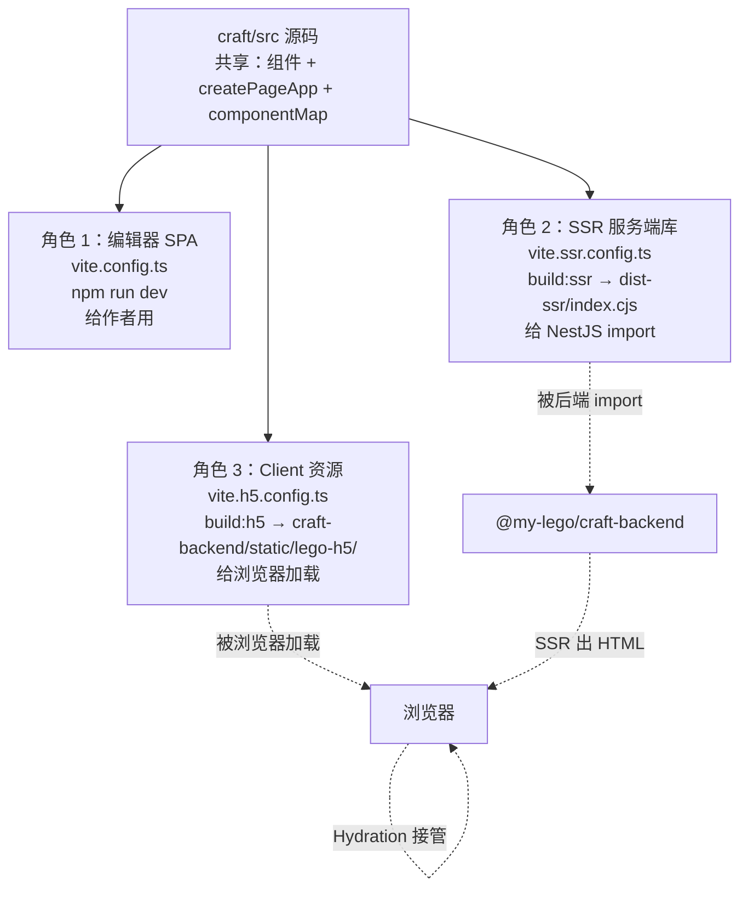
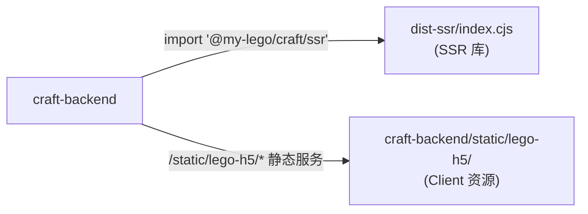

# @my-lego/craft

低代码 H5 编辑器前端，**同时承担三种角色**：作者使用的编辑器 SPA、给后端调用的 SSR 服务端库、浏览器加载的 Client Hydration 资源。

> 本包是 `my-lego` monorepo 的子包，请先阅读 [根 README](../../README.md) 了解整体业务再回来看这里的细节。

---

## 1. 这个包是干什么的

`@my-lego/craft` 在不同的构建配置下会输出**三种完全不同形态**的产物，服务三种使用场景：

- **角色 1：编辑器 SPA**——给作者拖拽组件、调样式、发布作品。
- **角色 2：SSR 服务端库**——以 `@my-lego/craft/ssr` 子入口暴露给 `craft-backend`，让后端能在 Node 里把 `work.content` 渲染成 HTML 字符串。
- **角色 3：Client Hydration 资源**——构建产物直接输出到 `craft-backend/static/lego-h5/`，浏览器加载后接管 SSR 出的 DOM 完成水合。

---

## 2. ★ 核心特色：一份源码三种角色

这是本包**最容易让新人绕晕**的点，请务必先理解。

### 2.1 三角色全景



### 2.2 三种产物对比

| 角色 | Vite 配置 | 输出 | 运行环境 | 消费方 |
| --- | --- | --- | --- | --- |
| 编辑器 SPA | `vite.config.ts` | `dist/`（dev 直用） | 浏览器 | 作者 |
| SSR 服务端库 | `vite.ssr.config.ts` | `dist-ssr/index.cjs` + `dist-ssr/types/index.d.cts` | Node.js | `craft-backend` |
| Client Hydration 资源 | `vite.h5.config.ts` | `../craft-backend/static/lego-h5/assets/*` + `.vite/manifest.json` | 浏览器 | 终端用户 |

### 2.3 为什么不能合成一份产物

它们的运行环境、external 策略、是否需要 hash、是否需要 manifest、输出目录全部不同。强行合成会让某一边出问题。

完整的"五维度对比 + 各配置项逐一解释"见 [BizDocs/06 §5](../../BizDocs/06-作品发布页SSR与Hydration流程.md)。

---

## 3. 技术栈

| 类别 | 技术 |
| --- | --- |
| 框架 | Vue 3.5（含 TSX） |
| 构建 | Vite 7（三套配置） |
| 状态管理 | Pinia 3 |
| 路由 | Vue Router 4 |
| UI 组件 | ant-design-vue 4 + @ant-design/icons-vue |
| 拖拽 | vue-draggable-plus |
| 工具库 | @vueuse/core / lodash-es / hotkeys-js / mitt |
| 媒体处理 | html2canvas / cropperjs / qrcode |
| 类型生成 | vite-plugin-dts（rollupTypes 单文件输出） |
| 测试 | Vitest 4 + @vue/test-utils |

**Node 要求**：`^20.19.0 || >=22.12.0`（来自 `package.json` 的 `engines.node`）。

---

## 4. 目录结构

```text
packages/craft/
├── src/
│   ├── api/             # axios 实例 + 各业务 API 模块
│   ├── assets/          # 图片/字体等静态资源
│   ├── components/      # 物料组件（LText/LImage…）+ componentMap 注册
│   ├── handlers/        # 全局副作用 handler（HTTP 错误等）
│   ├── hooks/           # 通用组合式 API（useLoadMore/useFetchWork…）
│   ├── layouts/         # 全局布局组件（MainLayout）
│   ├── router/          # vue-router 路由表 + 守卫
│   ├── ssr/             # ★ SSR 子模块（同时供 server / client 使用）
│   │   ├── index.ts             # 库入口（被 package.json exports 指向）
│   │   ├── types.ts             # WorkContent / ComponentData
│   │   ├── createPageApp.tsx    # 共享：创建 Vue App
│   │   ├── renderWorkToHTML.ts  # Server 入口：renderToString
│   │   └── clientEntry.ts       # Client 入口：mount('#app') 完成 Hydration
│   ├── stores/          # Pinia stores（editor/history/user…）
│   ├── styles/          # 全局样式
│   ├── types/           # 全局类型定义
│   ├── utils/           # 工具函数
│   ├── views/           # 页面级组件（HomeView/EditorView/LoginView…）
│   ├── App.vue          # 根组件
│   └── main.ts          # SPA 入口
├── vite.config.ts          # 角色 1：编辑器 SPA
├── vite.h5.config.ts       # 角色 3：Client Hydration 资源
├── vite.ssr.config.ts      # 角色 2：SSR 服务端库
├── vitest.config.ts        # 单测配置
├── tsconfig.app.json       # SPA 应用 + dts 生成
├── tsconfig.node.json      # node 工具脚本
├── tsconfig.vitest.json    # 测试
├── env.d.ts                # *.vue 模块声明 + Vite 环境类型
└── package.json
```

### 4.1 重点目录说明

- **`src/components/index.ts`**：导出 `componentMap` 与 `ComponentKey` 类型。**新增物料组件时必须改这里**，否则 SSR 在 `componentMap[comp.name]` 取不到值会静默丢渲染（`return null`）。
- **`src/ssr/`**：SSR 子模块的全部代码。**这里的代码必须 SSR 安全**——不能 import pinia/router、不能直接用 window/document/localStorage 等浏览器 API，否则 Node 端会抛 ReferenceError。
- **`src/views/EditorView/`**：编辑器主体。和 SSR 链路无关，只服务于"作者拖拽"场景。

---

## 5. 快速开始

### 5.1 安装

```bash
# 在仓库根目录
pnpm install
```

### 5.2 启动编辑器（角色 1）

```bash
pnpm -F @my-lego/craft dev
# 或在本目录：pnpm dev
```

打开 [http://localhost:5173](http://localhost:5173)，登录后开始拖拽。

> 编辑器需要 craft-backend 同时运行（默认走 `http://localhost:3000`）。后端启动方式见 [craft-backend 的 README](../craft-backend/README.md)。

### 5.3 构建 SSR 库（角色 2）

```bash
pnpm -F @my-lego/craft build:ssr
```

输出到 `dist-ssr/`：

- `index.cjs`：CJS 库主体（被后端 import）
- `types/index.d.cts`：dts 单文件（rollup 后）

### 5.4 构建 Client 资源（角色 3）

```bash
pnpm -F @my-lego/craft build:h5
```

输出到 **`../craft-backend/static/lego-h5/`**（注意：跨包写入，不是本包目录）：

- `assets/clientEntry-*.js / *.css`（带 hash）
- `.vite/manifest.json`（被后端解析）

> ⚠️ `vite.h5.config.ts` 配了 `emptyOutDir: true`，每次 build 会**清空** `craft-backend/static/lego-h5/`，不要手工往这个目录放别的文件。

### 5.5 单测 / lint

```bash
pnpm test:unit          # 单测一次
pnpm test:unit:watch    # 单测 watch
pnpm test:unit:coverage # 含覆盖率
pnpm lint
pnpm lint:fix
pnpm type-check         # vue-tsc 类型检查（含 SPA + 测试）
```

---

## 6. 与其它包的关系

### 6.1 上游依赖

- **`@my-lego/shared`**（workspace）：共享工具/类型（`isString` / `isArray` / `createSafeJson` 等）。

### 6.2 下游消费方

- **`@my-lego/craft-backend`** 通过两条路径消费本包：



`exports` 字段定义在本包 `package.json`：

```json
"exports": {
  "./ssr": {
    "require": "./dist-ssr/index.cjs",
    "types": "./dist-ssr/types/index.d.cts"
  }
}
```

> 因此外部只能 `import '@my-lego/craft/ssr'`，无法访问编辑器内部代码（`stores/views` 等），保证了 SSR 边界清晰。

---

## 7. 关键约定与避坑速查

### 7.1 SSR 入口禁用项

`src/ssr/` 下的代码（含其引用链上的所有文件）**禁止**：

- 直接 import pinia、vue-router 并在顶层调用。
- 直接使用 `window` / `document` / `localStorage` / `navigator` 等浏览器 API。
- 引用编辑器侧的 store/router 单例（会跨请求污染数据）。

如果某个组件确实需要这些能力（例如 `useRouter`），用 `if (typeof window !== 'undefined')` 守卫起来，或者把这部分逻辑挪到 mount 之后。

### 7.2 componentMap 必须 SSR/CSR 一致

`src/components/index.ts` 的 `componentMap` 同时被 SSR 和 CSR 消费。新增/重命名组件必须保证：

- 两边都能解析到**同一个**实现。
- 同一个 `comp.props` 在两边渲染出**结构一致**的 DOM（否则 Hydration 会 mismatch）。

### 7.3 dev 不会自动 build SSR/H5 产物

- `pnpm dev` 只是启动编辑器 SPA dev server。
- `dist-ssr/` 和 `craft-backend/static/lego-h5/` 只有跑过 `build:ssr` / `build:h5` 才会更新。
- 改了 `src/ssr/` 或 `src/components/` 的代码，需要：
  ```bash
  pnpm build:h5 && pnpm build:ssr
  ```
  并**重启 craft-backend**（manifest 进程内缓存）。

### 7.4 dts 必须先 build:ssr 才会生成

后端报"找不到模块 `@my-lego/craft/ssr`"红线时，先跑 `pnpm build:ssr` 把 `dist-ssr/types/index.d.cts` 产出来。详见 [BizDocs/06 §6.5](../../BizDocs/06-作品发布页SSR与Hydration流程.md)。

---

## 8. 相关文档

| 文档 | 主题 |
| --- | --- |
| [根 README](../../README.md) | 项目业务总览 |
| [BizDocs/01 Monorepo 搭建指南](../../BizDocs/01-my-lego%20Monorepo%20项目搭建指南.md) | TS/ESLint/Vite alias 统一方案 |
| [BizDocs/03 SSR 方案决策](../../BizDocs/03-SSR%20接口前端组件集成（cursor_chat）.md) | SSR 方案的完整决策过程 |
| [**BizDocs/06 SSR 与 Hydration 流程**](../../BizDocs/06-作品发布页SSR与Hydration流程.md) | **最重要**：打包/链路/限制/排障全链路（必读） |
| [BizDocs/07 Work 业务模型](../../BizDocs/07-Work作品业务模型与权限规则.md) | 作品状态机、可见性、模板、渠道 |
